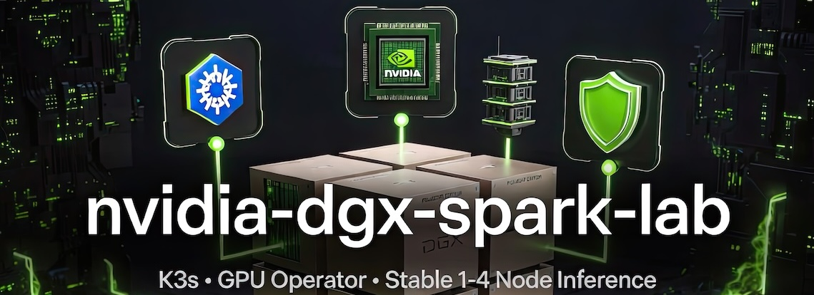

# nvidia-dgx-spark-lab

[](https://toxicoder.github.io/nvidia-dgx-spark-lab/latest/)
[](https://toxicoder.github.io/nvidia-dgx-spark-lab/development/)
[](https://github.com/toxicoder/nvidia-dgx-spark-lab/actions/workflows/ci.yml)
[](LICENSE)
[](docs/BUILDING_WITH_BAZEL.md)



**Documentation:** [latest](https://toxicoder.github.io/nvidia-dgx-spark-lab/latest/) (from `main`) · [development](https://toxicoder.github.io/nvidia-dgx-spark-lab/development/) (from `development`) — Fumadocs (Next.js) with Orama search, glossary tooltips, Mermaid, and live editable command variables.

**Suggested GitHub topics** (set in repo Settings → General → Topics): `k3s`, `nvidia`, `dgx`, `bazel`, `fumadocs`, `gpu`, `inference`, `ansible`, `kubernetes`.

**What's on this page**

- Project goals and core safety principles
- Node role table (five supported fabrics: 1 / 2 / 3 / 4 / 5 nodes)
- Core components (K3s, GPU Operator, Ansible + cloud-init, Helm vs raw manifests)
- High-speed interconnect and NCCL configuration
- High-level repository layout
- Links to getting started and other sections

**What this enables**

- Quickly understanding the lab's scope (small 1-5 node DGX Spark clusters for large inference)
- Seeing the emphasis on stability, explicit resources, and no auto-start of heavy jobs
- Deciding where to go next: [Getting Started](https://toxicoder.github.io/nvidia-dgx-spark-lab/latest/getting-started/) (Start tab). Compose Comfy: [ez-comfy-stack](https://github.com/toxicoder/ez-comfy-stack)

## Goals

- Run very large models (e.g. Kimi-K2.6 and similar) reliably without freezing the host or making SSH unresponsive.
- Utilize the high-speed interconnect fabric between nodes (pair, ring, or switch).
- Provide both a heavy production configuration and a lighter/safer test mode.
- Never auto-start heavy containers on reboot.
- Everything managed through simple, auditable scripts and manifests.


## Node Roles (Scalable 1-5 nodes, five fabrics)

The declarative topology `ansible/inventory/lab.yaml` declares the fabric and marks exactly one
node `role: orchestrator` — the K3s control plane. Any Spark can be it (default `spark0`);
re-assigning it moves the control plane without re-cabling.

| Nodes | Fabric (`lab.yaml` `fabric:`) | Role configuration | High-speed interconnect |
|-------|-------------------------------|--------------------|-------------------------|
| 1 | `none` | control-plane + worker (all-in-one) | none — local NCCL (SHM/P2P) |
| 2 | `pair` | control-plane + worker; 1 worker | one QSFP cable, 200 Gb/s |
| 3 | `ring` | control-plane + worker; 2 workers | QSFP triangle, 200 Gb/s per pair |
| 4 | `switch` | control-plane + worker; 3 workers | Mikrotik CRS804-4DDQ-hRM, full ports |
| 5 | `switch` | control-plane + worker; 4 workers | CRS804, one 400G port split to two 200G breakout lanes |

Multi-node NCCL / tensor-parallel ride the fabric's high-speed links. Do **not** copy the 2-node pair `NCCL_*` env onto a ring or switch lab. See [Choose topology](https://toxicoder.github.io/nvidia-dgx-spark-lab/latest/start/choose-topology/).

## Core Components

- **K3s** as the lightweight Kubernetes distribution
- **NVIDIA GPU Operator** for driver, device plugin, and MIG management
- Kubernetes manifests (no Docker Compose for workloads)
- Ansible + cloud-init (early OS/highspeed prep) for idempotent cluster bootstrap
- Helm charts (Coder, Kasm, GPU Operator, monitoring, custom dashboard) for K8s apps; raw manifests + kustomize for safety-critical inference workloads
- Strict resource requests/limits on all heavy workloads
- `restartPolicy: OnFailure` with low backoff for big models

## High-Speed Interconnect (for 2+ nodes)

**2-node pair (reference):** one 200 Gb/s QSFP cable. Existing 1-node / 2-node Jobs use:

- `NCCL_SOCKET_IFNAME=enp1s0f0np0,enp1s0f1np1`
- `NCCL_IB_HCA=mlx5_0,mlx5_1` (or equivalent)

`ansible/inventory/group_vars/all.yml` `highspeed_*` / `nccl_env` document that pair. Do **not** copy them onto a 3-node ring.

**3-node QSFP ring (Mode B and Mode C):** 200 Gb/s per pair, triangle mesh, OOB on 10GbE (often `enP7s7`), payload on all four CX-7 RoCE devices. See [LiteLLM rounded stack](docs/litellm-rounded-stack.md). Not NVLink.

**4/5-node CRS804 switch:** one RoCE link per node on its own /24 (the generated per-node netplan); `NCCL_SOCKET_IFNAME` stays on the management NIC, payload on the single RoCE HCA. See [Choose topology](https://toxicoder.github.io/nvidia-dgx-spark-lab/latest/start/choose-topology/).

For 1 node: standard local multi-GPU NCCL (SHM/P2P) is used.

See workload manifests for exact settings.

## Repository Layout

```
nvidia-dgx-spark-lab/
├── ansible/          # Cluster bootstrap (playbooks, roles, cloud-init examples)
├── config/           # Resource Guard policy, lab-domains, Nemotron catalog
├── dashboard/        # Next.js lab portal (panels, secrets vault, visual goldens)
├── docs/             # Documentation content, project-conventions.md, generators
├── docs-site/        # Fumadocs (Next.js) site that renders docs/
├── helm/             # lab-dashboard Helm chart
├── hermes/           # Host Docker agent (profiles, docker-compose)
├── k8s/
│   ├── base/         # Namespaces, Resource Guard
│   ├── dev/          # Dashboard dev manifests, Coder templates
│   ├── overlays/     # test, prod, single-node
│   └── workloads/    # kimi, nemotron-*, qwen3.5-*, qwen3.6-*, glm-5.2, ray-*
├── lints/            # Bazel-wrapped linters
├── mcp/              # MCP Agent Toolkit (policy, k8s workloads, docker)
├── scripts/          # manage.sh, lib/*.sh, utilities/
├── tests/            # BATS + safety invariants
├── BUILD.bazel       # Primary entry: bazelisk run //:validate
├── CONTRIBUTING.md   # Short contribution hub
└── AGENTS.md         # AI agent workflow
```

## Quick Start

1. **Operator client + topology file**
   ```bash
   ./scripts/utilities/install-operator-client.sh run   # one command: Ansible, kubectl, helm, bazelisk
   # Declare the lab (fabric, node IPs, switch port map, orchestrator) in ansible/inventory/lab.yaml,
   # then render the inventory / netplan / cloud-init from it:
   bazelisk run //:manage -- setup            # guided wizard (prompts, then writes + renders)
   # or non-interactive: bazelisk run //:manage -- topology render
   ```
   Legacy fallback: `cp ansible/inventory/hosts.ini.example ansible/inventory/hosts.ini` and edit by hand
   (skips the generated netplan / cloud-init). See [Lab topology](https://toxicoder.github.io/nvidia-dgx-spark-lab/latest/start/lab-topology/).

2. **Bootstrap the Cluster** (works for 1 or 2-5 nodes)
   ```bash
   # Preferred when working Bazel-first:
   bazelisk run //ansible:bootstrap -- -i inventory/hosts.ini

   # Classic direct:
   cd ansible
   ansible-playbook -i inventory/hosts.ini playbooks/bootstrap-cluster.yml
   ```

3. **Install GPU Operator**
   ```bash
   bazelisk run //ansible:gpu-operator -- -i inventory/hosts.ini
   # or
   ansible-playbook -i inventory/hosts.ini playbooks/install-gpu-operator.yml
   ```

4. **Verify cluster**
   ```bash
   bazelisk run //ansible:verify -- -i inventory/hosts.ini
   ```

5. **Deploy Workloads (via script)**
   ```bash
   bazelisk run //:manage -- status
   bazelisk run //:manage -- start-test
   bazelisk run //:manage -- start-kimi   # heavy; after kimi-test
   bazelisk run //:manage -- stop
   # classic: ./scripts/manage.sh start-test
   ```

See the [Getting Started guide](https://toxicoder.github.io/nvidia-dgx-spark-lab/latest/getting-started/) for the gold path (1-5 node topologies, cloud-init, Ansible, GPU Operator, `doctor`, first `kimi-test`, dashboard URL, reboot reminder). Prefer `bazelisk run //:manage -- <verb>` (equivalent: `./scripts/manage.sh <verb>`).

The auto-generated command reference is [Shell Commands & Helpers](https://toxicoder.github.io/nvidia-dgx-spark-lab/latest/generated/shell/reference/) (`bazelisk run //docs:docs`). Workload numbers: [Workload catalog](https://toxicoder.github.io/nvidia-dgx-spark-lab/latest/operate/workload-catalog/). `group_vars/all.yml` is reference only.

## Safety First

- Heavy workloads use `restartPolicy: OnFailure` with low `backoffLimit` (1 or 2).
- No Deployments with `replicas` that auto-restart on large models.
- The `manage.sh` script includes pre-flight resource checks and confirmation for heavy mode.
- After reboot, workloads do **not** come back automatically. You must explicitly start them.
- Always stop workloads before rebooting (see [Reboot Safety](https://toxicoder.github.io/nvidia-dgx-spark-lab/latest/reboot-safety/)).

## Modes

| Mode       | Purpose                     | Resource Profile     | Safety Level     |
|------------|-----------------------------|----------------------|------------------|
| kimi-test  | Quick validation & testing  | Lower (1-2 GPUs)     | High             |
| kimi       | Full production inference   | Full multi-GPU       | Guarded          |

## Managing the Cluster

All day-to-day operations go through the management script:

```bash
./scripts/manage.sh help
./scripts/manage.sh doctor
./scripts/manage.sh estimate kimi-test
```

Common operations:

- `start-test` — deploy lighter test workload
- `start-kimi` — deploy full heavy workload (with confirmation)
- `estimate <model>` — resource estimator with editable placeholders
- `stop` — delete active workloads
- `status` — show pods, nodes, GPU resources
- `cleanup` — remove all managed resources

**Pro tip**: The documentation site now features **live editable variables** in command examples (see Getting Started). Edit SPARK0_IP etc. and the copy buttons use your values.

## Agent Chat (Open WebUI + Hermes)

For browser-based agent chat with MCP tool orchestration, deploy the backing stacks then Open WebUI:

```bash
./scripts/manage.sh start-nemotron   # or nemotron-stack preset
./scripts/manage.sh start-mcp
./scripts/manage.sh start-hermes
./scripts/manage.sh start-open-webui
```

See [Open WebUI](https://toxicoder.github.io/nvidia-dgx-spark-lab/latest/open-webui/) and [Hermes Agent](https://toxicoder.github.io/nvidia-dgx-spark-lab/latest/hermes-agent/).

## Remote Development: Coder Workspaces + Kasm + Dashboard

See [Dev Workspaces & Dashboard](https://toxicoder.github.io/nvidia-dgx-spark-lab/latest/dev-workspaces/) for:

- Setup with Ansible + Helm (Coder, Kasm, Headlamp + Grafana for metrics, custom lab portal).
- `scripts/manage.sh` commands: `start-coder`, `start-kasm`, `start-monitoring`, `stop-dev` etc.
- NodePort access (e.g. 32080 for Coder) or VPN notes (traefik disabled by design for stability).
- Example Coder templates, Grafana dashboards for GPUs (via GPU Operator DCGM), safety/resource notes.
- How the custom dashboard provides quick status, copyable commands, and links (Headlamp for K8s, Grafana graphs, workspace launch).

**Safety note**: Dev tools use Deployments with explicit (conservative) resources/limits. Heavy inference Jobs remain OnFailure + low backoff, no auto-start.

## Rebooting Safely

1. Stop workloads first:
   ```bash
   ./scripts/manage.sh stop
   ```
2. Reboot nodes (order doesn't strictly matter but prefer spark1 then spark0).
3. After nodes are up, re-apply cluster config if needed:
   ```bash
   ansible-playbook -i inventory/hosts.ini playbooks/bootstrap-cluster.yml
   ```
4. Manually start the workload you need.

## Development & Testing (Bazel is the primary entry point)

**Bazel** is the main build system and entry point for the entire codebase (tests, lint, docs, validation).

```bash
bazelisk test //:test                     # recommended: hermetic BATS + safety checks
bazelisk test //:lint --test_tag_filters=manual   # all linters (shell/yaml/k8s/ansible)
bazelisk run //:manage -- status          # the cluster management tool
bazelisk run //docs:serve                 # local documentation site (live reload)
bazelisk run //ansible:bootstrap          # (uses example inventory; pass -i for real)
bazelisk run //dashboard:dev
bazelisk build //...
```

Makefile (thin compatibility shim — most targets delegate to Bazel):

```bash
make help
make lint
make test
make test-all
```

Direct tools (still fully supported for day-to-day cluster ops, especially runtime ops):

```bash
./scripts/manage.sh help
./scripts/manage.sh status
```

See `docs/BUILDING_WITH_BAZEL.md`, the [Getting Started guide](https://toxicoder.github.io/nvidia-dgx-spark-lab/latest/getting-started/), and `docs/CONTRIBUTING.md`.

### What the tests cover
- Shell script correctness and safety logic (`scripts/manage.sh`)
- All Kubernetes manifests are valid against Kubernetes schemas
- Critical production invariants (correct `restartPolicy`, `backoffLimit`, NCCL vars, resource limits)
- Ansible playbook syntax and basic linting

The core BATS tests now also run fully hermetically under Bazel (vendored bats-core + runfiles).

See [tests/README.md](tests/README.md) and the BUILD.bazel files.

### Documentation

The documentation site is **Fumadocs** on the Next.js App Router, published at [https://toxicoder.github.io/nvidia-dgx-spark-lab](https://toxicoder.github.io/nvidia-dgx-spark-lab)

- **Read online:** [Documentation site](https://toxicoder.github.io/nvidia-dgx-spark-lab)
- **Serve locally:** `bazelisk run //docs:serve` (hot reload; `./docs/manage-docs.sh serve` is the same thing)
- **Static export:** `bazelisk run //docs:docs` → `docs-site/out/`
- **Preview the export:** `bazelisk run //docs:preview`
- **Checks:** `bazelisk test //docs:test_docs_site_render //docs-site:unit //docs-site:typecheck`
- **Screenshots:** `bazelisk run //docs-site:visual-linux` (baselines render in the CI image; needs Docker — add `-- --update` to refresh them)
- **Options:** `--port`, `--no-browser`, `--version latest|development`
- **Contributor guide:** `docs/CONTRIBUTING.md`, `docs/BUILDING_WITH_BAZEL.md`, migration notes in `MIGRATION.md`
- Doc generation is incremental (shell reference skips writes when unchanged) and driven from source comments.

Content lives in `docs/`; `docs-site/` is the app that renders it. The site keeps the sidebar
groups, breadcrumbs, Mermaid diagrams, callouts, tabs, glossary tooltips, Orama search, and the
live editable command-variables panel the previous site had.

CI deploys docs via `.github/workflows/deploy-docs.yml` **after merge** (push to `main` / `development` with changes under `docs/**` or `docs-site/**`), or via manual `workflow_dispatch` — not when a PR is opened. PR docs checks run in the main CI suite (`docs-and-render`).

See `docs/CONTRIBUTING.md` (if present) or `AGENTS.md` for contribution guidelines.

### Local tool installation (example)

```bash
# Ubuntu/Debian
sudo apt install shellcheck yamllint bats
pip install ansible ansible-lint
# kubeconform + bats (if not packaged)
curl -sL https://github.com/yannh/kubeconform/releases/latest/download/kubeconform-linux-amd64.tar.gz | tar xz && sudo mv kubeconform /usr/local/bin/
```

Never rely on Kubernetes to auto-restart heavy inference pods.

## Known Limitations & DGX Spark Notes

- Large models can easily OOM or starve the control plane if resource limits are too loose.
- Avoid `imagePullPolicy: Always` on huge images.
- SSH can become unresponsive if the node is under extreme memory pressure — always set conservative limits.
- High-speed links require correct interface naming and NCCL env vars; misconfiguration falls back to slower paths.
- Watch for thermal/power limits on sustained inference.

See [DGX Spark Notes](https://toxicoder.github.io/nvidia-dgx-spark-lab/latest/dgx-spark-notes/) and [Reboot Safety](https://toxicoder.github.io/nvidia-dgx-spark-lab/latest/reboot-safety/) for more.

## Contributing / Modifying

Keep changes practical. Prioritize:
1. Stability
2. Resource control
3. Simplicity of operations

When adding new workloads, duplicate the kimi-test pattern and adjust resources upward only after validation.

## Support My Projects

If you find this repository helpful and would like to support its development, consider making a donation:

### GitHub Sponsors
[](https://github.com/sponsors/toxicoder)

### Buy Me a Coffee
<a href="https://www.buymeacoffee.com/toxicoder" target="_blank">
    
</a>

### PayPal
[](https://www.paypal.com/donate/?hosted_button_id=LSHNL8YLSU3W6)

### Ko-fi
<a href="https://ko-fi.com/toxicoder" target="_blank">
    
</a>

Your support helps maintain and improve this collection of development tools and templates. Thank you for contributing to open source!

## License

This project is licensed under the MIT License. See the [LICENSE](LICENSE) file for details.

This repository contains infrastructure code, Kubernetes manifests, and scripts for a specialized AI lab cluster. It is not intended for production use outside controlled research / lab environments. Always follow the safety guidelines in [Reboot Safety](https://toxicoder.github.io/nvidia-dgx-spark-lab/latest/reboot-safety/) and [AGENTS.md](AGENTS.md).
