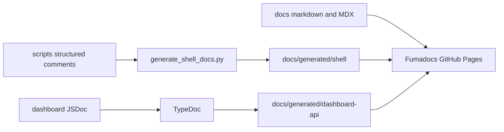

# Building and Testing with Bazel

**What's on this page**

- Why Bazel is the primary build/test/launcher system for the lab
- List of what Bazel is used for (tests, lint, docs, wrappers)
- Prerequisites and installation
- Common commands and specific targets
- Documentation generation details
- Validation discipline and CI setup
- How to use Bazel day-to-day and inside the dev container

**What this enables**

- Reproducible, hermetic builds and tests even on different developer machines
- Single command entry points (e.g. `bazelisk run //docs:docs`, `bazelisk run //:manage -- doctor`)
- Easy onboarding via the `.devcontainer`
- Confidence that changes don't break the automation or docs pipeline

The traditional Makefile and direct `ansible-playbook` / `./scripts/manage.sh` invocations remain available for compatibility and for people who have not installed bazelisk.

## Prerequisites

- Bazelisk (strongly recommended)
- Or a recent Bazel 8.x+

```bash
# macOS
brew install bazelisk

# Linux (example)
# amd64:
curl -L https://github.com/bazelbuild/bazelisk/releases/latest/download/bazelisk-linux-amd64 -o /usr/local/bin/bazelisk
# arm64 (Apple Silicon):
# curl -L https://github.com/bazelbuild/bazelisk/releases/latest/download/bazelisk-linux-arm64 -o /usr/local/bin/bazelisk
chmod +x /usr/local/bin/bazelisk
```

The `.bazelversion` pins the version.

## Common Commands

```bash
# Primary day-to-day commands
bazelisk run //:validate           # git-aware: core + docs/dashboard when paths change
bazelisk run //:validate -- --all # full suite (docs Playwright + dashboard Docker)
bazelisk test //:test              # Bazel test_suite (test-fast + docs render)
bazelisk test //:test-fast         # CI core (excludes slow docs Playwright)
bazelisk test //:lint --test_tag_filters=manual
bazelisk run //:manage -- status
bazelisk run //docs:serve
bazelisk run //ansible:bootstrap

# Specific targets
bazelisk run //docs:docs           # static export of the docs site into docs-site/out/
bazelisk run //docs:render-check   # checks against that export (run //docs:docs first)
bazelisk run //docs-site:unit      # Vitest suite for the site widgets
bazelisk run //docs-site:typecheck # next typegen + tsc
bazelisk run //docs-site:visual-linux # screenshot baselines in the CI image (needs Docker)
bazelisk run //dashboard:dev
bazelisk run //ansible:verify -- -i inventory/hosts.ini

# Build / test everything declared
bazelisk test //...
bazelisk build //...

# Queries (very useful)
bazelisk query 'kind(".*_test", //...)'
bazelisk query 'deps(//tests:bats_manage_test)'
```

## Documentation Generation & Efficiency

Documentation for commands, helpers, and internal APIs is generated from source so it **never goes stale**.



### Shell Commands & Helpers (the main auto-generated reference)

`docs/generate_shell_docs.py` is a tiny stdlib-only extractor that turns specially formatted comments in the shell scripts into a beautiful, human-readable reference page.

Markers (documented extensively in getting-started.md and CONTRIBUTING.md):

- `# ## Title` + rich body
- `# @command name` + description + Usage + Safety + Examples (with `{{PLACEHOLDER}}`)
- `# ### Subsection`

The generator now produces:

- Proper fenced code blocks using the `bash` language
- `!!! warning` / `!!! note` admonitions
- Clean separation between intentional docs and implementation comments
- Source attribution

It is deliberately strict about what it includes so the output is pleasant to read.

Run it with:
```bash
bazelisk run //docs:docs
```

The output is at `docs/generated/shell/reference.md` and appears in the site under **Reference > Code-Generated Reference**.

Because `//docs:docs` and `//docs:serve` list the script sources as data dependencies (via `//scripts:doc_sources`), Bazel only re-runs generation when comments actually change.

The generated trees are ordinary content to the site: `//docs-site:*` targets depend on
`//docs:content`, which globs `docs/generated/**` alongside the hand-written pages, so a
regenerated reference invalidates the build and the sidebar picks the new headings up with no
extra wiring.

### Dashboard API reference

Produced by TypeDoc from JSDoc in the Next.js/TypeScript code:

```bash
bazel run //dashboard:docs     # after npm ci in dashboard/
```

See `dashboard/typedoc.json` and the package.json `docs:generate` script.

### Visual regression tests for the rendered docs site (goldens + approval)

Docs checks are split by what they need, so a one-line edit does not pay for a browser:

- `//docs:test_docs_site_render` — source contract of every navigable page: frontmatter,
  the two overview sections, fenced languages, Mermaid label quoting, prose/list separation,
  and the navigation covering the pages the old site published (no browser, in `//:test-fast`)
- `//docs:render-check` — the same file run against the **exported** HTML: search index and
  tags, Mermaid/callout elements, the edit-on-GitHub link, and the cluster-variables panel
  keeping its tokens editable. A `run` target, because it reads `docs-site/out/`
- `//docs-site:unit` — Vitest over the ported widgets and the content transforms
- `//docs-site:typecheck` — `next typegen` + `tsc --noEmit`
- `//docs-site:visual-linux` — screenshot baselines rendered inside the pinned Playwright
  container, i.e. the same renderer the `docs-and-render` job compares against (needs Docker)
- `//docs-site:visual` — the same suite on the host browser; a debugging aid for one
  environment, not how baselines are produced (`manual`-tagged: a browser cannot launch inside
  a sandboxed test action)
- `//docs-site:visual_tooling_test` — guards that the container image stays pinned to the
  Playwright release the suite imports, that it matches the CI platform, and that the spec never
  invents a baseline under CI

The visual suite serves the export itself (`playwright.config.mjs` `webServer` runs
`scripts/serve_static.mjs`), so nothing has to be started by hand. It captures the ten pages
whose rendering carries risk — index, getting-started, architecture, models-catalog,
troubleshooting, reboot-safety, dgx-spark-notes, monitoring-observability, dev-workspaces,
gitea-ci-setup — at both desktop and mobile widths, waits for hydration plus the client-side
Mermaid SVGs, and drives every animation and transition to its end state before capturing so
baselines are reproducible.

- Any change to Markdown, MDX, components, CSS, or generated content that moves pixels fails
  the suite with a diff, rather than being noticed by a reader.
- **Baselines come from the CI image, not from a laptop.** Font metrics differ per platform, so
  a macOS golden will not match Linux CI Chromium and fails `docs-and-render`. The launcher
  builds the export inside the container as well, because the Next production bundle carries
  platform-specific native code, and the container refuses to render unless it reports the CI
  architecture. Refresh and review:

  ```bash
  bazelisk run //docs-site:visual-linux -- --update   # or: npm run visual:linux:update
  ```

  Under CI a page with no baseline is a hard failure rather than a silent self-capture, so no
  unreviewed screenshot can be committed. Pixel changes are reviewed like code.

`//:test-fast` deliberately excludes the browser work: it stays runnable without a Chromium
download, which is what makes it the cheap default in `bazel-core`.

### Multi-version public docs (latest + development)

The MkDocs site published two aliases with **mike**; Fumadocs has no mike equivalent, so the
same URLs are produced by building the static export twice with different `basePath` values:

| Alias | Branch | Build target | URL |
| --- | --- | --- | --- |
| `latest` (default) | `main` | `//docs-site:build-latest` (`DOCS_ALIAS=latest`) | `…/nvidia-dgx-spark-lab/latest/` |
| `development` | `development` | `//docs-site:build-development` (`DOCS_ALIAS=development`) | `…/nvidia-dgx-spark-lab/development/` |

`DOCS_ALIAS` makes Next bake `basePath=/nvidia-dgx-spark-lab/<alias>` into every asset URL.
A host-root prefix such as `/latest` would request `https://<user>.github.io/latest/_next/...`
and 404 on GitHub project Pages.

Both aliases come from the same commit, so they never disagree about content, and each is a
complete export (assets and the search index are baked with their prefix, so they are not
shared between prefixes). A root `index.html` forwards bare URLs to `/latest/`, which keeps
every previously published and bookmarked address working — no redirect service required.

Workflow: `.github/workflows/deploy-docs.yml` runs **only on push** to `main`/`master`/`development`
(docs paths) or `workflow_dispatch` — not on `pull_request`. Merging a PR into those branches is
what publishes; PR-time docs validation is the `docs-and-render` CI job, not this workflow. The
job assembles `_site/{latest,development}`, writes a root `.nojekyll` (GitHub Pages still uses
the legacy `gh-pages` branch, which otherwise runs Jekyll and drops Next's `_next/` tree), and
fast-forwards that branch. Never force-push `gh-pages`.

`DGX_DOCS_VERSION` is the branch-aware knob the MkDocs hooks used, now read by the app:

- `development` renders the non-production banner
- “Edit on GitHub” points at `edit/development/docs/…` (otherwise `edit/main/docs/…`)
- in-repo GitHub source links resolve against the same long-lived ref

Optional local override: `DGX_DOCS_GIT_REF=development` (or `main`). Feature-branch names are not
auto-mapped, since an edit link into an unpublished branch would 404.

Local dev (`bazelisk run //docs:serve`) builds neither alias: it serves at the root with hot
reload, which is the right thing for authoring.

### Why this design?

- Comments that describe behavior live right next to the code that implements it.
- One change in a script comment → reference, examples on the site, and live panel examples all update together.
- Over-documenting in the scripts is explicitly encouraged (see user request and AGENTS guidance).

See the Mermaid pipeline at the top of this section and [CONTRIBUTING.md](CONTRIBUTING.md) for markers, workflow, and contribution instructions.

The previous short paragraph has been replaced by this more complete description.

## Validation Discipline (used during development)

After any change, use the unified orchestrator:

```bash
bazelisk run //:validate                    # default: git-aware slices
bazelisk run //:validate -- --all           # full suite before merge
bazelisk run //:validate -- --update-goldens  # regenerate visual baselines (review + commit)
bazelisk run //:fix                         # formatters + auto-fix linters (trusted tools)
```

`//:validate` always runs core checks (`build //... --nobuild`, `//:test-fast`, `//:lint`, key builds). When docs-relevant paths change (`docs/**`, `docs-site/**`, shell doc sources under `scripts/manage.sh` / `lib` / `utilities`) it also runs `//docs:test_docs_site_render` + `//docs-site:unit` + `//docs-site:typecheck` + `//docs-site:visual_tooling_test` (fast, no browser). Use `--all` to add the static export, the export-backed `//docs:render-check`, the screenshot comparison in the CI container (`//docs-site:visual-linux`, needs Docker), and `//dashboard:hermetic-test` (Docker + Playwright). `--update-goldens` captures fresh baselines in that same container instead of comparing. Default dashboard slice uses `//dashboard:fast-test` (host Vitest + lint + typecheck).

`//:fix` uses only well-trusted software (buildifier, shfmt, ruff, prettier) and is the recommended one-command way to programmatically clean the tree.

CI uses path-filtered parallel jobs (optimized for wall time):

| Job | When | What |
| --- | --- | --- |
| **bazel-core** | scripts/k8s/… or CI graph/workflow | `//:test-fast` + `//:lint` + key builds |
| **dashboard-unit** | dashboard/** or CI graph | Host Vitest + lint + tsc |
| **dashboard-hermetic** | after unit success | Docker build + Playwright (`DASHBOARD_TEST_MODE=visual` skips re-Vitest) |
| **docs-and-render** | docs/**, docs-site/**, shell doc sources, or CI graph | Docs gates without a browser, then the export + `//docs:render-check` + the screenshot comparison in the CI container |
| **validate-gate** | always | Pure bash `scripts/ci_check_only.sh` (no Bazel cold start) |

**Path filter notes:** `scripts/**` no longer always runs docs — only `scripts/manage.sh`, `scripts/lib/**`, and `scripts/utilities/**` (shell doc sources). Editing only `.github/workflows/*` runs bazel-core (and gate), not hermetic/docs. Shared setup: `.github/actions/setup-bazel` (pinned Bazelisk + disk/repo + lint-tool caches). See `.github/workflows/ci.yml`, `.gitea/workflows/ci.yml`, and `.bazelrc` (`--config=ci`).

Use queries heavily:

```bash
bazelisk query 'deps(//tests:bats_manage_test)'
bazelisk query 'kind(".*_test", //...)'
bazelisk query 'rdeps(//scripts:manage, //k8s/...)'
```

## CI

See `.github/workflows/ci.yml` (path-filtered jobs + `validate-gate`). **bazel-core** is authoritative for hermetic core tests; docs Playwright runs only in **docs-and-render** (not duplicated in bazel-core).

Use `--config=ci` on CI runners (higher `--jobs`, `--remote_download_minimal`).

The classic make-based paths remain for compatibility/legacy.

For Gitea: see [gitea-ci-setup.md](gitea-ci-setup.md) and `.gitea/workflows/ci.yml` (self-hosted runners + persistent cache volumes recommended).

Bazel jobs restore disk/repo cache via `.github/actions/setup-bazel` (keyed on `MODULE.bazel.lock` + `.bazelversion`).

## Security Notes

- Never commit real `ansible/inventory/hosts.ini` (it is gitignored).
- Kubeconfig, tokens, and SSH material are excluded.
- The BATS tests mock external commands (including kubectl) so they never touch real clusters or credentials.
- Bazel runfiles + explicit data dependencies make exactly what is needed visible (no accidental leakage of host files).
- `MODULE.bazel.lock` is committed (standard for reproducible Bzlmod) and contains only public registry metadata.

See the root `.gitignore` and `.bazelignore` for the full exclusion list.

## Current Bazel Coverage

The following are modeled with first-class Bazel targets:

- `scripts/manage.sh` as `sh_binary` (`//:manage`)
- Full hermetic BATS suite (vendored bats-core)
- Kubernetes manifests and overlays as `filegroup` data
- Documentation site (`//docs:serve`, `//docs:docs`, `//docs-site:*`)
  - Includes `//docs:test_generate_shell_docs`, the docs gates in `//:test-fast`, and the export +
    **real browser screenshots vs goldens** in the docs job (visual diffs fail the job and require
    explicit approval via `//docs-site:visual-linux -- --update` + PR review).
- Ansible validation + convenient playbook launchers (`//ansible:*`)
- Dashboard dev / build / test wrappers (`//dashboard:*`)
- Comprehensive root aliases and test suites

Runtime operations against real hardware (full Ansible playbooks with real inventories, heavy cluster workloads) intentionally remain outside pure Bazel "build" semantics and are launched via the sh_binary wrappers or classic commands.

## Using Bazel for Daily Work

Bazel is now the established primary system. The Makefile and direct commands remain available purely for compatibility and convenience.

## Development Container

First-class multi-arch contributor environment (`.devcontainer/`): **linux/amd64 + linux/arm64**.

| Host | Notes |
| --- | --- |
| macOS Apple Silicon / Intel | Docker Desktop |
| Windows x86_64 | Docker Desktop + WSL2 |
| Linux amd64/arm64 | Docker Engine / Podman |
| NVIDIA DGX Spark (Grace arm64) | Docker/Podman on-box |

Pinned tools (see `.devcontainer/tool-versions.env`, shared with CI): bazelisk, buildifier, shfmt, shellcheck, kubeconform, kubectl, helm, ansible, ruff, mypy, Node **22**, Python **3.11**, prettier, bats, kcov, Grok Build CLI.

Full onboarding: **[dev-environment.md](dev-environment.md)**.

### Using the Dev Container

1. Open the repo in VS Code or Cursor (Docker running).
2. Command Palette → **Dev Containers: Reopen in Container**.
3. After `post-create` + doctor:

```bash
bash .devcontainer/doctor.sh
bazelisk run //:fix
bazelisk run //:validate
bazelisk test //:test-fast --config=ci
bazelisk test //:lint --test_tag_filters=manual
```

Docker for hermetic dashboard tests uses **docker-outside-of-docker** (host engine). Create does **not** gate on the full suite; use `//:validate` before PRs.

### Code-Driven Documentation

Reference material for commands, helpers, and dashboard internals is generated from source comments (`docs/generate_shell_docs.py` + TypeDoc in `dashboard/`).

After changing comments in `scripts/` or JSDoc in `dashboard/`:

```bash
bazelisk run //docs:docs
```

Generated content lands in `docs/generated/` and is served by the docs site (Reference).

See `AGENTS.md` for AI coding assistant workflow.
