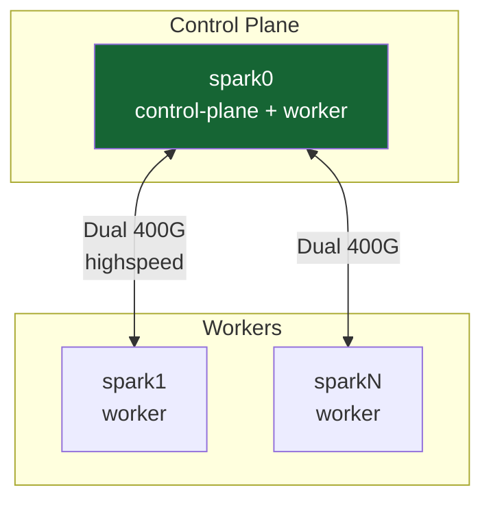
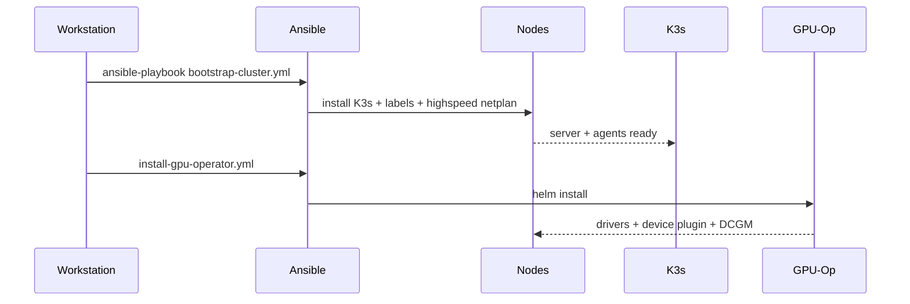
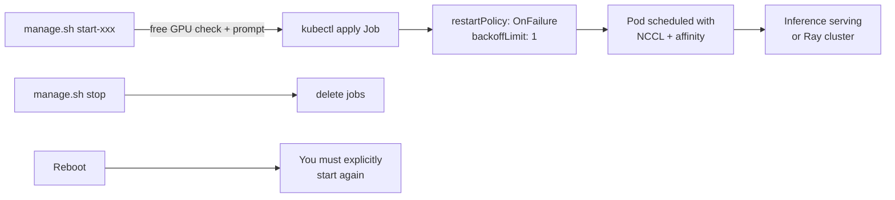
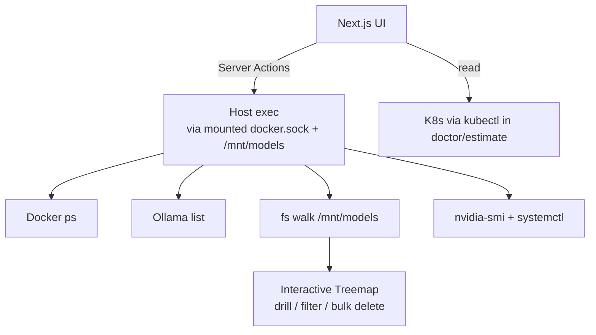

# Architecture Overview

**What's on this page**

- High-level cluster diagram (1-4 nodes with control-plane + workers + dual 400G links)
- Bootstrap flow (workstation → Ansible → K3s + GPU Operator)
- Safe workload lifecycle (manage.sh prompts → Job apply → OnFailure + low backoff)
- Dashboard data flow (Next.js → docker.sock / kubectl / ollama / fs)
- Enforced safety invariants (explicit resources, no Always restart for heavy jobs, NCCL only on high-speed)

**What this enables**

- Understanding the "why" behind design choices for host stability and performance
- Safe extension or debugging of the system while preserving core guarantees
- Quick mental model before editing playbooks, manifests, or scripts

## High-Level Cluster

## Bootstrap Flow

## Workload Lifecycle (Safe by Design)

## Dashboard Data Flow

## Safety Invariants (Enforced)

- Heavy inference = **Job** + `OnFailure` + `backoff:1`
- Explicit requests **and** limits on every container
- No `Always` restart for large models
- NCCL only on high-speed interfaces for multi-node
- All mutations go through `manage.sh` (with prompts for heavy)

See AGENTS.md for the full list.
