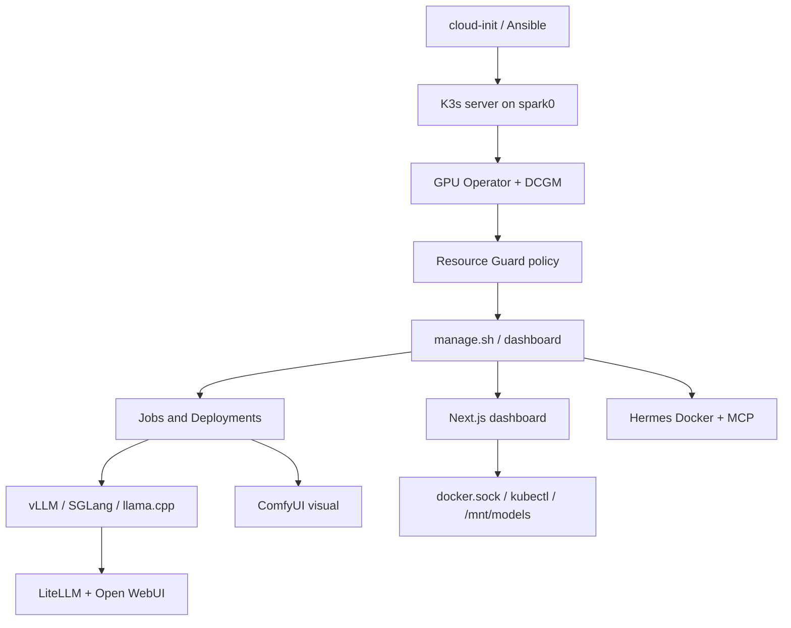
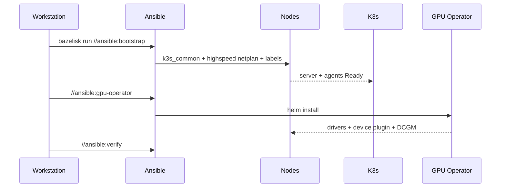
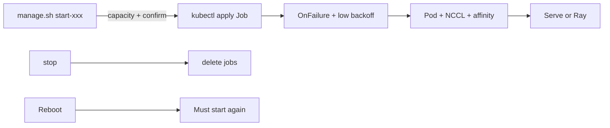
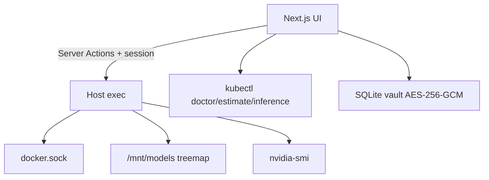
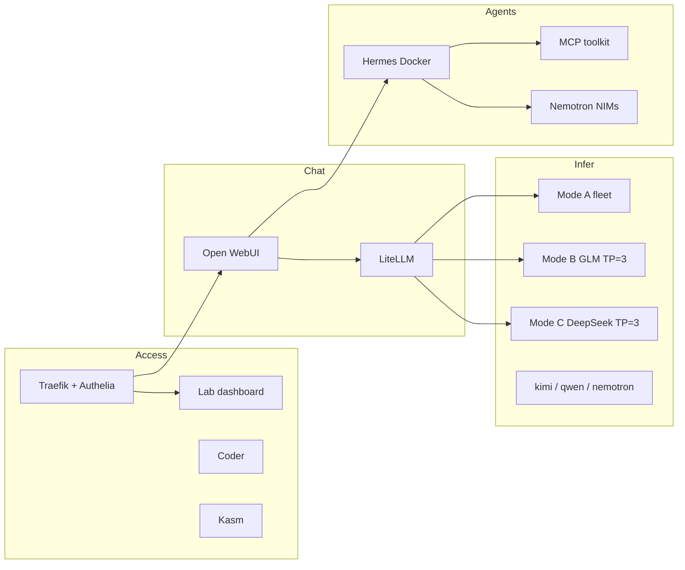

# Architecture Overview

**What's on this page**

- End-to-end pipeline from first boot to a serving Job
- 1 / 2 / 3 / 4 node roles and overlay matrix
- Dashboard host-action path and docker.sock
- Cross-stack map: Open WebUI, Hermes, MCP, SSO, Nemotron, LiteLLM
- Enforced safety invariants

**What this enables**

- Extending playbooks or manifests without breaking host stability
- Seeing why visual Comfy here is K3s, not Compose

## Pipeline

## Node roles

| Nodes | spark0 | Others | Fabric |
| --- | --- | --- | --- |
| 1 | control-plane + worker | — | local NCCL only |
| 2 | control-plane + worker | spark1 worker | dual QSFP ~400G pair |
| 3 | control-plane + worker | spark1–2 | QSFP **ring** 200 Gb/s/pair |
| 4 | control-plane + worker | spark1–3 | TP=4 Jobs; do not copy pair env |

Details: [Choose topology](start/choose-topology.md) · [Interconnect & NCCL](concepts/interconnect-nccl.md).

## Bootstrap flow

Playbooks: [Ansible catalog](operate/ansible-catalog.md). cloud-init templates: `ansible/cloud-init/example-user-data-1node.yaml` and `2node.yaml`.

## Overlay matrix

| Overlay | Points at | Role |
| --- | --- | --- |
| `k8s/overlays/test` | kimi-test + lighter patch | First validation |
| `k8s/overlays/prod` | kimi (no patches) | Production kimi entry |
| `k8s/overlays/single-node` | kimi-test TP=1 GPU=1 | One host |
| `k8s/overlays/rounded-stack` | 35B + Flash-Next + MedGemma + LiteLLM | Mode A |
| `k8s/overlays/rounded-stack-quality` | 27B on spark2 instead of MedGemma | Mode A `--quality` |

[Overlays](operate/overlays.md).

## Workload lifecycle

Visual Comfy uses **Deployments** but still **manual start**, one at a time, Resource Guard + heavy confirm.

## Dashboard data flow

Helm chart `helm/lab-dashboard/` NodePort 32082. Operator journey: [Dashboard](operate/dashboard.md).

<Callout type="warning" title="docker.sock">
  Login to the dashboard implies Tasks/Storage power on the node. Keep auth; no `AUTH_BYPASS` in production.
</Callout>
## Cross-stack map

Modes A/B/C are mutually exclusive. [LiteLLM rounded stack](litellm-rounded-stack.md) · [Open WebUI](open-webui.md) · [Hermes](hermes-agent.md) · [MCP](mcp-agent-toolkit.md) · [SSO](sso.md) · [Nemotron](nemotron-agentic-stack.md).

## Visual Comfy (K3s)

`k8s/workloads/comfy-base` + `comfy-visual/*`, `scripts/lib/visual.sh`. Models on `/mnt/models`. Compose sibling: [ez-comfy-stack](https://github.com/toxicoder/ez-comfy-stack).

## Safety invariants (enforced)

- Heavy inference = Job + `OnFailure` + low `backoffLimit` (never `Always`)
- Explicit requests **and** limits
- Resource Guard 15% / 24Gi floor
- NCCL only on the correct high-speed plane
- Mutations through `manage.sh` / dashboard with confirms
- No auto-start after reboot

Tests: `bazelisk test //tests:safety_invariants`. Agent list: [AGENTS.md](https://github.com/toxicoder/nvidia-dgx-spark-lab/blob/main/AGENTS.md).
