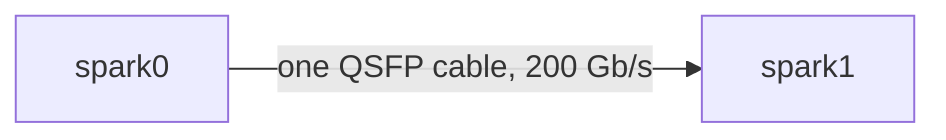
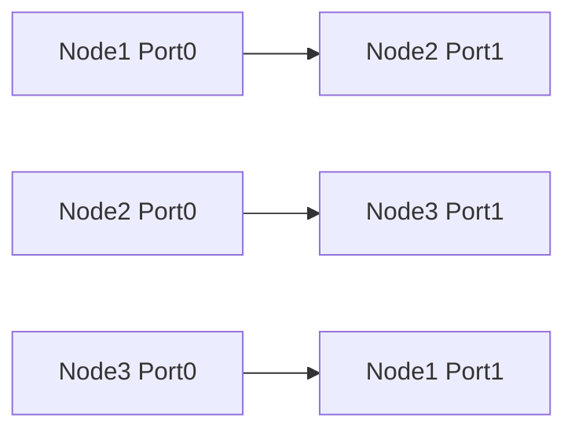
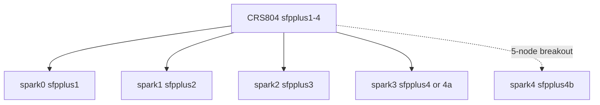

# Interconnect and NCCL

**What's on this page**

- Three fabrics this lab actually ships: 2-node pair, 3-node QSFP ring, 4/5-node CRS804 switch
- Which env vars belong to which Jobs
- How to verify with `ibdev2netdev`, ping, logs, and `doctor-fabric`

**What this enables**

- Setting `NCCL_SOCKET_IFNAME` and `NCCL_IB_HCA` from live devices, not folklore
- Not copying `group_vars` pair env onto Mode B/C ring Jobs or switch labs

Authoritative **runtime** values are in `k8s/workloads/*` Job YAML. `ansible/inventory/group_vars/all.yml` `highspeed_*` / `nccl_env` is **reference for a 2-node pair only**.
The 3/4/5-node netplans come from the declarative topology: [Lab topology](../start/lab-topology.md).

## Planes

| Plane | Typical names | Carries |
| --- | --- | --- |
| LAN / management | RJ-45 10GbE, often `enP7s7` | K3s, SSH, dashboard, LiteLLM, NCCL bootstrap / Gloo |
| High-speed | ConnectX-7 QSFP | NCCL payload / tensor-parallel all-reduce |

K3s/Flannel stay on the LAN. Do not put Kubernetes on the QSFP nets.

## 1 node

No inter-node NCCL. Local multi-GPU (if advertised) uses SHM/P2P. The `highspeed` inventory group is ignored.

## 2-node pair (one 200 Gb/s QSFP cable)



Each physical QSFP cage appears as two Linux netdevs (two PCIe x4 twins). One cable brings one cage up — do not assume both cages are populated.

Existing 1-node / 2-node Jobs and `group_vars` document:

```text
NCCL_SOCKET_IFNAME=enp1s0f0np0,enp1s0f1np1
NCCL_IB_HCA=mlx5_0,mlx5_1
```

Also typically `NCCL_IB_DISABLE=0`, `NCCL_P2P_DISABLE=0`, `NCCL_SHM_DISABLE=0`. Confirm names with `ibdev2netdev` on **your** nodes before baking env.

kimi / kimi-test omit `hostNetwork` (isolation). Heavy Ray / GLM-5.2 Jobs set `hostNetwork: true` (and GLM `hostIPC: true`) so IFNAME is visible.

## 3-node QSFP ring (Mode B and Mode C)

200 Gb/s per physical port — not NVLink, not an IB switch. Triangle:



Port0 = cage next to the RJ-45 jack; Port1 = far cage. Wrong polarity looks half-alive.

Mode B (GLM-5.3-Flash TP=3) and Mode C (DeepSeek-V4.1-Flash TP=3) Jobs set:

```text
NCCL_SOCKET_IFNAME=<mgmt, default enP7s7>
NCCL_IB_HCA=rocep1s0f0,roceP2p1s0f0,rocep1s0f1,roceP2p1s0f1
NCCL_IB_DISABLE=0
NCCL_IB_MERGE_NICS=0
NCCL_NET_PLUGIN=none
NCCL_IB_SUBNET_AWARE_ROUTING=1
```

Plus `hostNetwork: true` and `hostIPC: true`. If 10GbE is not `enP7s7`, set `LAB_MGMT_IFNAME`. Mode C also cuts `NCCL_BUFFSIZE=1MiB`.

<Callout type="error" title="Do not copy the 2-node pair block onto ring Jobs">
  `highspeed_interfaces: enp1s0f0np0,enp1s0f1np1` is the pair reference. Ring Jobs in `k8s/workloads/glm-5.3-flash/` and `deepseek-v4.1-flash/` already have the ring block.
</Callout>
Full cabling, aliases, and util caps: [LiteLLM rounded stack](../litellm-rounded-stack.md).

## 4 / 5 nodes — Mikrotik CRS804-4DDQ-hRM switch

The switch fabric is a managed 4× 400G QSFP-DD device; each node sees **one** RoCE link:



- **4 nodes:** one full CRS804 port per node (`sfpplus1`…`sfpplus4`). The Spark CX-7 link is 200 Gb/s.
- **5 nodes:** three full ports + one port split with a breakout cable into
  `sfpplus4a` / `sfpplus4b` (two 200G lanes). Both lanes must be declared in the
  `switch.port_map` — the topology validator rejects a lone lane.
- Each link is its own /24 (192.168.110–114, MTU 9000) from the generated per-node
  netplan — one node per subnet, so there is no shared-suffix IP scheme to get wrong.
- `NCCL_SOCKET_IFNAME` stays the management NIC; the payload rides the single RoCE HCA
  (`NCCL_IB_HCA` from live `ibdev2netdev` names per node).
- Heavy Jobs use `hostNetwork: true`. Do not assume the 2-node pair
  `NCCL_SOCKET_IFNAME` list is complete — it is not, on a switch.

The switch block (host, read-only user, `port_map`) lives in `lab.yaml`; the password is
`LAB_SWITCH_PASSWORD` in the operator's environment only. Qwen 3.5 397B NVFP4 is the
canonical TP=4 Job here. Cabling and port map: [Choose topology](../start/choose-topology.md).

## Verify

```bash
# On each node (console or SSH)
ibdev2netdev
ip -br link
```

<Tabs groupId="bazel-classic" items={["Bazel", "Classic"]} persist>
  <Tab value="Bazel">
    ```bash
    bazelisk run //:manage -- doctor
    bazelisk run //:manage -- doctor-fabric
    ```
  </Tab>
  <Tab value="Classic">
    ```bash
    ./scripts/manage.sh doctor
    ./scripts/manage.sh doctor-fabric
    ```
  </Tab>
</Tabs>
After `start-test` on a pair:

```bash
kubectl logs -n {{NAMESPACE}} -l app=kimi-test --tail=100 | grep -i nccl
```

Expect the high-speed IFNAME in the NCCL init lines, not the management NIC as payload.

<Callout type="warning" title="Mis-iface">
  If logs show fallback to `eth0` / 10GbE for all-reduce, stop the Job (`bazelisk run //:manage -- stop`) and fix netplan / Job env before retrying a heavy TP Job.
</Callout>