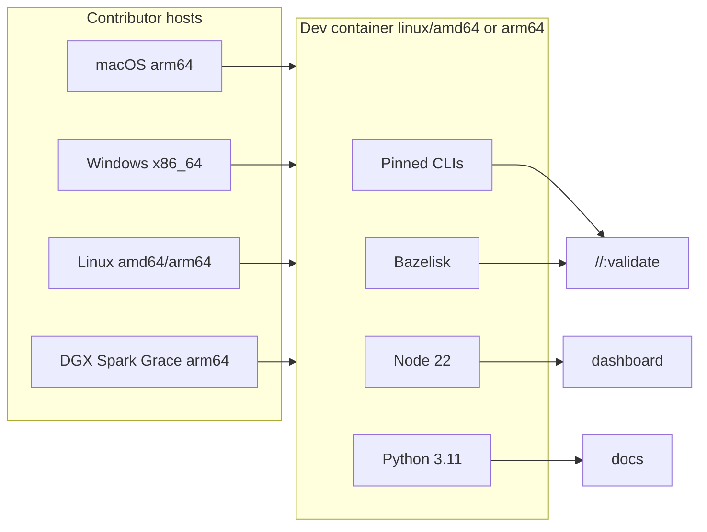

# Developer Environment

**What's on this page**

- Supported hosts and architectures (Apple Silicon, Windows x86, Linux, DGX Spark)
- Recommended path: multi-arch Dev Container
- First-five-minutes workflow (`doctor` → `//:fix` → `//:validate`)
- Host bootstrap without a container
- Branching model for contributions
- Caches, Docker, troubleshooting

**What this enables**

- Opening the repo on almost any workstation and matching CI tooling
- Contributing to scripts, Kubernetes YAML, dashboard, and docs without a GPU cluster
- Avoiding “works on my machine” version skew

!!! note "Software contribution vs cluster ops"
    This page is for **writing and testing code** in this repository.  
    Bringing up K3s on DGX Spark nodes is covered in [Getting Started](getting-started.md).

## Branching model

- **Primary integration branch:** `development` (protected, PR-required).
- Branch all feature work **from `development`** and open PRs **into `development`**.
- **Promotion path:** feature → `development` → (optional) `dev` → `main` (always via PR).
- **Never force-push** `development` or `main`.

Clone and start from the integration tip:

```bash
git fetch origin
git checkout development
git pull origin development
git checkout -b feature/your-change
```

See also [CONTRIBUTING.md (repo root)](https://github.com/toxicoder/nvidia-dgx-spark-lab/blob/main/CONTRIBUTING.md) and [AGENTS.md](https://github.com/toxicoder/nvidia-dgx-spark-lab/blob/main/AGENTS.md).

## Supported platforms

The contributor image is **Linux multi-arch** (`linux/amd64` + `linux/arm64`). The same
`.devcontainer/` definition runs on:

| Host | CPU | How it runs |
| --- | --- | --- |
| **macOS Apple Silicon** | arm64 | Docker Desktop → arm64 Linux container |
| **macOS Intel** | x86_64 | Docker Desktop → amd64 Linux container |
| **Windows 10/11** | x86_64 | Docker Desktop + **WSL2** → amd64 Linux container |
| **Linux workstation** | amd64 or arm64 | Docker Engine / Podman → matching arch |
| **NVIDIA DGX Spark** | arm64 (Grace) | Docker/Podman on the Spark → arm64 Linux container |
| **GitHub Codespaces** | typically amd64 | Uses `.devcontainer/` automatically |

**No GPU is required** for unit tests, lint, docs, or dashboard Vitest. GPU nodes matter only when you operate real workloads.

Tool pins live in [`.devcontainer/tool-versions.env`](https://github.com/toxicoder/nvidia-dgx-spark-lab/blob/main/.devcontainer/tool-versions.env) and are shared with CI.

## Recommended: Dev Container

### Prerequisites

1. **Docker**
   - macOS / Windows: [Docker Desktop](https://www.docker.com/products/docker-desktop/)
   - Linux / DGX Spark: Docker Engine or Podman with a Docker-compatible socket
2. **VS Code**, **Cursor**, or Codespaces with the **Dev Containers** extension
3. ~8 GB RAM and ~32 GB free disk (see `hostRequirements` in `devcontainer.json`)

### Open the container

1. Clone the repository.
2. Open the folder in VS Code / Cursor.
3. Command Palette → **Dev Containers: Reopen in Container**.
4. Wait for image build (first time) + `post-create` (npm + docs + doctor).

```bash
bash .devcontainer/doctor.sh
bazelisk run //:fix
bazelisk run //:validate
```

### What the container provides

| Area | Tools |
| --- | --- |
| Build / test | Bazelisk (Bazel from `.bazelversion`), buildifier |
| Shell | shellcheck, shfmt, bats, kcov |
| Python | 3.11, ruff, mypy, pytest, MkDocs deps |
| Node | 22 (dashboard), prettier |
| K8s | kubectl (pinned), helm, kubeconform |
| Ansible | ansible, ansible-lint |
| Docker | **docker-outside-of-docker** (host engine) for hermetic dashboard images |
| Agent CLIs | [Grok Build](https://github.com/xai-org/grok-build) (`grok`), [Hermes Agent](https://github.com/NousResearch/hermes-agent) (`hermes`) via post-create |

### Agent CLIs and secrets

Post-create runs `.devcontainer/install-agent-clis.sh` (skip with
`DEVCONTAINER_SKIP_AGENT_CLIS=1`). Installers **never** write API keys.

```bash
grok login          # interactive auth → volume ~/.grok (not git)
hermes setup        # interactive provider/model → volume ~/.hermes (not git)
```

!!! warning "Never commit agent credentials"
    Do not put `GROK_DEPLOYMENT_KEY`, OpenRouter/OpenAI/etc. keys, or Hermes
    auth files in the repo, in `devcontainer.json` env blocks, or in screenshots
    of create logs. Auth lives only on Docker volumes or your host home dir.
    See [SECURITY.md](https://github.com/toxicoder/nvidia-dgx-spark-lab/blob/main/SECURITY.md).

Hermes **on the Spark host** (Docker gateway stacks) is documented separately in
[hermes-agent.md](hermes-agent.md).

Lifecycle (optimized):

1. **Image build** — pinned CLIs (Dockerfile)
2. **updateContentCommand** — `post-create.sh --deps-only` (npm, docs, Playwright)
3. **postCreateCommand** — full post-create + doctor  
   Full `//:test` is **not** a create gate (optional `DEVCONTAINER_SMOKE=1`).

Named volumes cache Bazel disk/repo, npm, pip, and Playwright across rebuilds.

### Day-to-day commands

```bash
bazelisk run //:fix                         # formatters
bazelisk run //:validate                    # git-aware checks
bazelisk run //:validate -- --all           # before merge
bazelisk test //:test-fast --config=ci      # CI core suite
bazelisk run //docs:serve -- --port 8080    # docs (port forwarded)
cd dashboard && npm run dev                 # portal on :3000
bazelisk run //dashboard:fast-test          # Vitest + lint + tsc
bazelisk run //dashboard:hermetic-test      # needs host Docker
```

VS Code tasks under **Terminal → Run Task** wrap the same targets.

## Without a container (host tools)

Prefer the container for parity. If you must work on the host:

```bash
./scripts/utilities/install-dev-tools.sh status
./scripts/utilities/install-dev-tools.sh run     # Linux/macOS best-effort
```

Linux CI-style lint install (amd64 **and** arm64):

```bash
bash scripts/ci/install-lint-tools.sh
```

Then install **Node 22+**, run `cd dashboard && npm ci`, and `docs/setup-docs.sh` for MkDocs.

On **Windows**, use WSL2 Ubuntu and either the devcontainer or the Linux host path above—not native PowerShell for Bazel/lint.

## Architecture notes



## Troubleshooting

| Symptom | Fix |
| --- | --- |
| Create failed / doctor red | **Rebuild Container**; check Docker is running; run `bash .devcontainer/doctor.sh` |
| `docker` missing in container | Host Docker must be running (docker-outside-of-docker uses the host socket) |
| Apple Silicon slow first build | Expected; caches make rebuilds much faster |
| Windows path issues | Clone under WSL filesystem (`\\wsl$\...`), not a slow `/mnt/c` tree |
| Hermetic dashboard tests fail | Need working `docker build` on the host engine |
| kcov / shell coverage | Linux container only; macOS host skips coverage (validate still OK) |
| Stale Bazel cache | `docker volume rm dgx-lab-bazel-disk dgx-lab-bazel-repo` then rebuild |
| Node version mismatch | Container and CI use **22**; set host Node 22 if not using the container |

## Related docs

- [Contributing hub](https://github.com/toxicoder/nvidia-dgx-spark-lab/blob/main/CONTRIBUTING.md)
- [Building with Bazel](BUILDING_WITH_BAZEL.md)
- [Project conventions](project-conventions.md)
- [Dev Workspaces (on-cluster Coder/Kasm)](dev-workspaces.md) — different from this laptop/container env
