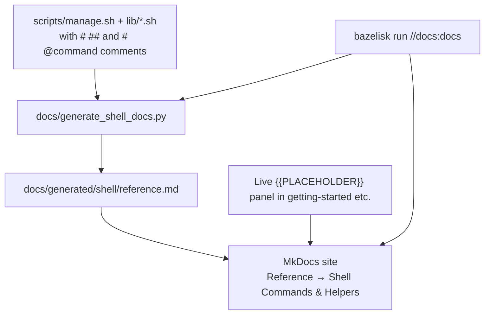

# Getting Started

> **Interactive docs**: Use the cluster variables panel below. Edit the values — every code example on this page (and many others) will update instantly and the Copy buttons will use the live values.

<div class="cluster-config admonition info" data-vars="SPARK0_IP,NAMESPACE,DASHBOARD_PORT">
  <p><strong>Live cluster variables</strong> (edits propagate to all examples + copies on this page)</p>
  <div>
    <!-- Defaults must match the primary profile button (1-node / localhost). -->
    <label>SPARK0_IP: <input data-var="SPARK0_IP" value="localhost" placeholder="spark0-ip"></label>
    <label>NAMESPACE: <input data-var="NAMESPACE" value="ai-inference"></label>
    <label>PORT example: <input data-var="DASHBOARD_PORT" value="32082"></label>
  </div>
  <div>
    <button type="button" data-profile="1node" class="md-button md-button--primary">1-node / localhost profile</button>
    <button type="button" data-profile="2node" class="md-button">2-node typical profile</button>
    <small>(live updates + copy buttons respect current values)</small>
  </div>
</div>

**What's on this page**

- Prerequisites (nodes, SSH, workstation tools)
- Detailed inventory setup (1-node / 2-node / 4-node tabs)
- Step-by-step bootstrap of K3s + GPU Operator (Bazel-first + classic)
- High-speed network configuration for multi-node
- Management script usage, workload deployment, verification, and cleanup
- Reboot safety procedures
- How the auto-generated reference and live variables panel work

**What this enables**

- Safely bringing up a full lab environment (single or multi-node) with all safety constraints active
- Following a repeatable, verified path that includes pre-flight checks at every major step
- Using the live cluster variables panel so all examples and copy buttons use your actual IPs/ports
- Understanding the automation (manage.sh, generated reference) that makes day-to-day operation practical

## Prerequisites

- 1-4 DGX Spark nodes (e.g. spark0 as control-plane; optional spark1+ workers) with:
  - Ubuntu 22.04 or 24.04 (recommended)
  - NVIDIA GPUs visible (`nvidia-smi`)
  - Dual QSFP112 400G cables connected between the nodes
  - SSH key access from your control machine to both nodes
  - Sudo privileges

- On your workstation:
  - Ansible >= 2.14
  - kubectl (will be installed/configured by Ansible)
  - helm

## Step 1: Prepare Inventory

!!! warning "Bazel-first + Safety"
    All examples below lead with Bazel where applicable.  
    **Never** proceed without a working inventory and verified connectivity.  
    Heavy workloads can make SSH unresponsive — always have out-of-band console access ready.

```bash
# Preferred (Bazel)
bazelisk run //ansible:playbook -- inventory/hosts.ini.example bootstrap-cluster.yml   # (or use the dedicated target)
# Classic
cd ansible/inventory
cp hosts.ini.example hosts.ini
```

### Detailed Inventory Editing (1-node vs multi-node)

Use tabs for clarity:

=== "1-node (simplest, recommended for first-time)"

    ```ini
    [spark0]
    spark0 ansible_host=192.168.1.10 ansible_user=ubuntu
    ```

    Only one control-plane + worker. High-speed interconnect is ignored.

=== "2-node (balanced, most common)"

    ```ini
    [spark0]
    spark0 ansible_host=192.168.1.10 ansible_user=ubuntu

    [spark1]
    spark1 ansible_host=192.168.1.11 ansible_user=ubuntu
    ```

    Dual 400G links between nodes for NCCL.

=== "4-node (full scale)"

    Add spark2 and spark3 similarly. Ensure all high-speed cables are connected.

**Verification after editing**:
```bash
ansible -i hosts.ini all -m ping
# Expected: all hosts should return pong (or success)
```

If ping fails:

- Check SSH keys (`ssh-copy-id` or manual).
- Verify no firewall on management network.
- Confirm exact IPs (use `ip a` on the nodes via console if needed).

See the auto-generated [Shell reference](generated/shell/reference.md) for the `setup` helper that can guide this interactively.

## Step 2: Bootstrap K3s Cluster (Hyper-Detailed)

**Bazel-first preferred** (uses the wrapper that defaults to the example inventory safely):

```bash
bazelisk run //ansible:bootstrap
# or with real inventory
bazelisk run //ansible:bootstrap -- -i inventory/hosts.ini
```

Classic direct (for reference):

```bash
cd ansible
ansible-playbook -i inventory/hosts.ini playbooks/bootstrap-cluster.yml
```

### What the playbook actually does (step-by-step inside)

1. Installs prerequisites (containerd, etc.) on all nodes.
2. Configures high-speed network (netplan + SSH) on 2+ node setups.
3. Installs K3s server on spark0 (control-plane + worker).
4. Joins additional nodes as agents (workers).
5. Applies labels (e.g., `highspeed=true` for multi-node).
6. Sets up kubeconfig on the control node.

**After the playbook finishes — mandatory verification (run these exactly)**:

```bash
# On your workstation
export KUBECONFIG=~/.kube/config   # (or path printed by ansible)
kubectl get nodes -o wide
```

**Expected output (example for 2-node)**:
```text
NAME     STATUS   ROLES                  AGE   VERSION
spark0   Ready    control-plane,master   5m    v1.30.x+k3s1
spark1   Ready    worker                 4m    v1.30.x+k3s1
```

Also verify high-speed awareness (if 2+ nodes):
```bash
kubectl get nodes -l highspeed=true
```

**If nodes are NotReady or only one appears**:

- Check ansible output for errors on the high-speed netplan step.
- On the node console: `journalctl -u k3s` (or k3s-agent on workers).
- Re-run the specific play or the full bootstrap.

See the full generated command reference for `setup` and related helpers: [Shell reference](generated/shell/reference.md).

**Bazel equivalent for the whole guided flow**:
```bash
bazelisk run //:manage -- setup
```

This prints the recommended sequence and can launch the first safe workload.

## Step 3: Install NVIDIA GPU Operator (Hyper-Detailed)

**Bazel-first**:
```bash
bazelisk run //ansible:gpu-operator -- -i inventory/hosts.ini
```

Classic:
```bash
ansible-playbook -i inventory/hosts.ini playbooks/install-gpu-operator.yml
```

### What happens
- Deploys the NVIDIA GPU Operator (drivers, device plugin, DCGM exporter for monitoring).
- Creates the `gpu-operator` namespace and required DaemonSets.
- Enables MIG / time-slicing if configured in inventory/group_vars.

**Watch the rollout (run in a separate terminal)**:

```bash
kubectl get pods -n gpu-operator -w
```

**Wait until all pods are Running** (can take 5–15+ minutes on first boot while drivers compile/install).

**Verification commands**:

```bash
# Nodes should report GPU capacity
kubectl describe node spark0 | grep -A 5 "nvidia.com/gpu"

# Or for all nodes
kubectl get nodes -o custom-columns=NAME:.metadata.name,GPU:.status.allocatable.nvidia.com/gpu

# DCGM exporter (for later Grafana)
kubectl get pods -n gpu-operator -l app=nvidia-dcgm-exporter
```

**Common issues & fixes** (use these as your troubleshooting reference):

- Driver pod CrashLooping → check `journalctl -u k3s` on the node; ensure the node has enough disk for the driver container image.
- No GPUs visible → run `nvidia-smi` directly on the node (via console). Re-run the GPU operator playbook.
- See [troubleshooting.md](troubleshooting.md) and the generated reference for `doctor`.

After this step you should have a functional Kubernetes cluster with visible GPUs.

**Next (Bazel or classic)**:
```bash
bazelisk run //:manage -- doctor
bazelisk run //:manage -- start-test
```

## Step 4: Use the Management Script

```bash
cd /path/to/nvidia-dgx-spark-lab
./scripts/manage.sh status
# dashboard will be at http://{{SPARK0_IP}}:{{DASHBOARD_PORT}}
```

See `./scripts/manage.sh help` for all options.

## High-speed Network Setup (multi-node with QSFP)

Included in bootstrap:

- Detects with ibdev2netdev

- Netplan for persistent highspeed IPs

- Passwordless SSH

- Validation (ping, SSH, basic test)

- NCCL scoped to highspeed

For 1 node, skipped.

## Automation & Convenience (recommended)

**Early node prep (new strategic option - cloud-init):**

For physical DGX nodes, use cloud-init for early OS/highspeed prep (prereqs, netplan, swapoff, sysctls) before full Ansible. This makes bootstrap faster and more consistent.

```bash
# Render templates (Bazel or ansible)
bazelisk run //ansible:playbook -- --extra-vars run_cloud_init_prep=true   # or direct
# Then feed rendered/ansible/cloud-init/rendered/user-data-*.yaml as user-data (iDRAC/MAAS) or apply manually + reboot.
# Follow with:
bazelisk run //ansible:bootstrap
```

See `ansible/playbooks/apply-cloud-init-prep.yml` and `ansible/cloud-init/`.

Then standard:

```bash
./scripts/manage.sh setup        # guided + optional full playbooks
bazelisk run //:manage -- start-default
bazelisk run //:manage -- urls
bazelisk run //ansible:full-lab-setup
```

**Dev stack (Helm):**

Coder, Kasm, monitoring, and the custom lab dashboard are deployed via Helm (idempotent).

```bash
bazelisk run //:manage -- start-coder
bazelisk run //:manage -- start-monitoring   # now also uses helm chart for dashboard
```

The lab-dashboard has its own chart under `helm/lab-dashboard/`.

See dev-workspaces.md and the auto-generated reference for commands.

See manage.sh help, README, and dev-workspaces.md.

## Deploying a Workload

The manage.sh supports selectable models for 1-4 nodes.

### Models

- start-test : lighter

- start-kimi : example full

- start-ray : ray cluster for multi node

- start-nemotron-3-ultra : Nemotron 3 Ultra (NVFP4, Ray pp=2)

- start-glm-5.2 : GLM-5.2 (1-bit UD-IQ1_M, llama.cpp RPC, 2-node)

Example:

```bash
./scripts/manage.sh start-ray
./scripts/manage.sh start-nemotron-3-ultra
```

The script includes safety: gpu util check <0.90, confirmation, free gpu check.

### Lighter test mode (recommended first)

```bash
./scripts/manage.sh start-test
```

This uses fewer resources and is safer to iterate on.

### Full production mode (Kimi etc.)

**Only after you have validated with the test workload:**

```bash
./scripts/manage.sh start-kimi
```

The script will prompt for confirmation because this mode is resource-heavy.

## Verifying Multi-Node / High-Speed Networking

After a multi-GPU workload is running:

```bash
kubectl logs -l app=kimi-test -c inference --tail=100 | grep -i nccl
```

Look for lines showing the high-speed interfaces being used.

## Cleaning Up

```bash
./scripts/manage.sh stop
./scripts/manage.sh cleanup
```

## Before Rebooting (Hyper-Detailed Safety Procedure)

**Golden rule (repeated for emphasis)**: Never reboot while heavy inference workloads are scheduled. Large models can exhaust host memory and make the node unreachable over SSH.

**Bazel-first full sequence**:

```bash
# 1. Stop from workstation
bazelisk run //:manage -- stop

# 2. Verify nothing is left (run on the control plane or via kubectl)
bazelisk run //:manage -- status
kubectl get pods -n ai-inference
```

**Classic (identical logic)**:
```bash
./scripts/manage.sh stop
# on the node if you still have console:
kubectl delete job --all -n ai-inference --ignore-not-found
```

**Full safe reboot checklist** (do in this exact order):

1. Stop all managed workloads (see above).
2. Confirm zero inference/ray pods.
3. Reboot workers first (spark1+), then control-plane (spark0). Use IPMI/iDRAC/console if SSH is already degraded.
4. After nodes come back:
   - Re-run any needed ansible playbooks (high-speed config can drift).
   - `bazelisk run //:manage -- doctor`
   - `bazelisk run //:manage -- start-test` (or your last known-good workload).

See the dedicated [reboot-safety.md](reboot-safety.md) for the complete out-of-band + post-reboot playbook sequence and the auto-generated reference for the `stop` command.

**Why this order?** The management script and manifests are deliberately designed with `restartPolicy: OnFailure` + low `backoffLimit` precisely so that nothing comes back automatically after a reboot. This is a core safety property of the lab.

## Next Steps

- Read [dgx-spark-notes.md](dgx-spark-notes.md) for important stability guidance
- Review the workload manifests in `k8s/workloads/`
- Adjust resource requests/limits in the manifests before running very large models
- Read [reboot-safety.md](reboot-safety.md)

## Running the Test Suite

Bazel is the primary way:

```bash
bazelisk test //:test
bazelisk test //:lint --test_tag_filters=manual
```

Makefile shims (delegates):

```bash
make lint
make test
```

See the top-level [README.md](https://github.com/toxicoder/nvidia-dgx-spark-lab/blob/main/README.md#development--testing) and the tests/ directory in the repository for full details.
The tests catch common mistakes (bad YAML, missing limits, accidental Always restart policies) without needing DGX hardware.

## Documentation from Code (Auto-Generated & Always Up-to-Date)

**How the docs stay accurate automatically** (core to this lab's documentation flow):

A dedicated, stdlib-only generator (`docs/generate_shell_docs.py`) scans the Bash scripts for *structured documentation comments*. It produces the human-readable [Shell Commands & Helpers reference](generated/shell/reference.md) that lives under **Reference > Code-Generated Reference** in the site nav.

Supported markers (use these for things that should appear in the reference):

```bash
# ## Section Title
# Rich multi-paragraph description.
# Can include:
#   - Safety notes
#   - Usage:
#     ./scripts/manage.sh foo
#   - Examples with {{SPARK0_IP}} placeholders
#
# ### Subsection
# More detail

# @command doctor
# Description of the doctor command...
```

The generator is deliberately strict and pretty-printing:

- Only intentional doc blocks after the markers are extracted.
- "Usage:" sections and shell examples become clean fenced code blocks using the `bash` language.
- "Safety", "Important", "Warning" blocks become `!!! warning` admonitions in the rendered docs.
- Internal implementation comments are ignored so the output stays pleasant to read.

It also preserves `{{PLACEHOLDER}}` tokens so the live cluster variables panel (at the top of this page and others) can substitute real values into the examples and copy buttons.

**Why we do it this way**:

- Single source of truth — the comments that explain the commands *are* the commands' documentation.
- Never goes stale as long as you update the comments when you change behavior.
- Powers both the static reference *and* the interactive live examples via the command-vars.js panel.
- Works for `manage.sh`, all the helpers in `lib/`, profiles, etc.

**The full pipeline** (Mermaid):


**Triggering regeneration (Bazel-first, always)**:
```bash
# Preferred (also runs the full strict site build)
bazelisk run //docs:docs

# During development
bazelisk run //docs:serve
```

Classic:
```bash
./docs/manage-docs.sh build --strict
```

**Extensive example — what a good doc comment looks like**

In `scripts/manage.sh`:

```bash
  doctor|preflight|check)
    ## doctor
    # Comprehensive pre-flight checks.
    #
    # Verifies tools, cluster reachability, free GPU capacity,
    # current workloads, and prints all the useful URLs.
    #
    # Usage:
    #   ./scripts/manage.sh doctor
    #
    # Safety:
    #   Read-only. Run this before every heavy start-* command.
    ...
```

After regeneration you get nice headings, a fenced usage block, and (if we added the Safety detection) an admonition.

**How to contribute to / maintain the auto-generated reference**

1. Find the command or helper you want to document (in `manage.sh` or `lib/*.sh`).
2. Add or improve a `# ## ...` or `# @command xxx` block with:
   - Clear description of what it does
   - Safety / confirmation / resource implications
   - Exact Usage
   - Realistic examples (use `{{SPARK0_IP}}`, `{{DASHBOARD_PORT}}` etc. when it makes sense)
3. Run `bazelisk run //docs:docs`
4. Look at `docs/generated/shell/reference.md` (or the built site) and the live panel.
5. If something looks ugly, improve either the comment or the generator's `_format_body` logic.
6. Commit the source comment changes (the generated file will be updated by the docs build).

See also the very detailed section in [CONTRIBUTING.md](CONTRIBUTING.md) under "Code-Generated Command Reference".

**Dashboard API reference**

The other code-generated reference is the Dashboard API docs (under the same Reference section). It is produced by TypeDoc from JSDoc comments in the Next.js/TypeScript code:

```bash
bazel run //dashboard:docs
```

After `npm ci` in the `dashboard/` directory.

**Related files you should know about**
- `docs/generate_shell_docs.py` — the extractor + pretty printer (read the docstring)
- `docs/test_generate_shell_docs.py` — ensures we never lose {{PLACEHOLDER}} support
- `docs/manage-docs.sh` and `docs/setup-docs.sh`
- `docs/hooks.py` (injects GitHub API 404 suppressor, etc.)
- The live substitution code in `docs/assets/javascripts/command-vars.js`

This whole system is one of the things that makes the documentation in this lab stay trustworthy even as the scripts evolve rapidly.

(The previous short "how the docs stay accurate" text has been replaced by this much more extensive guide.)

## Next Steps (after core setup)

- Read [dgx-spark-notes.md](dgx-spark-notes.md) for important stability guidance
- Review the workload manifests in `k8s/workloads/` (cross-reference the generated Shell ref for the manage.sh commands that deploy them)
- Adjust resource requests/limits in the manifests before running very large models
- Read [reboot-safety.md](reboot-safety.md)
- Explore the [auto-generated command reference](generated/shell/reference.md) for every option of `doctor`, `estimate`, `start-*`, etc.

## Running the Test Suite (Bazel primary)

```bash
bazelisk test //:test
bazelisk test //:lint --test_tag_filters=manual
```

Makefile shims (delegates, for compatibility):

```bash
make lint
make test
```

See the top-level [README.md](https://github.com/toxicoder/nvidia-dgx-spark-lab/blob/main/README.md#development--testing) and the tests/ directory for full details. The tests catch common mistakes (bad YAML, missing limits, accidental `Always` restart policies) without needing DGX hardware.

The generator itself also has dedicated unit test coverage under `bazelisk test //docs:test_generate_shell_docs`.
