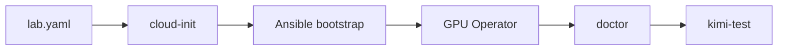

# Getting Started

<ClusterConfigPanel />

**What's on this page**

- Prerequisites (including the one-command operator-client setup) and out-of-band console
- The `lab.yaml` topology file for all five configurations (1 / 2 / 3 / 4 / 5 nodes)
- cloud-init, Ansible bootstrap, GPU Operator
- `doctor`, first verify, first safe workload (`kimi-test`)
- Dashboard URL and reboot reminder

**What this enables**

- A repeatable first cluster with Resource Guard and no auto-start
- Verification after every phase before a heavy Job

Topology choice: [Choose topology](start/choose-topology.md). Profiles after this page: [Profiles](start/profiles.md).



## Prerequisites

- 1–5 DGX Spark nodes, Ubuntu 22.04 or 24.04 (fabric per node count: [Choose topology](start/choose-topology.md))
- `nvidia-smi` works on the node
- SSH key + sudo from your workstation (operator client)
- **Out-of-band console** (IPMI/iDRAC) — heavy Jobs can still wedge SSH if you skip Guard
- Operator client (the machine that runs Ansible and `manage.sh`): Ansible ≥ 2.14, kubectl, helm, **bazelisk**

<Tabs groupId="operator-client-os" items={["macOS", "Linux", "Windows"]} persist>
  <Tab value="macOS">
    One command installs and verifies everything (Homebrew, no sudo):

    ```bash
    ./scripts/utilities/install-operator-client.sh run
    ```
  </Tab>
  <Tab value="Linux">
    Same script, apt/dnf based:

    ```bash
    ./scripts/utilities/install-operator-client.sh run
    ```
  </Tab>
  <Tab value="Windows">
    Install WSL2 + Ubuntu once (PowerShell), then the same script inside WSL:

    ```powershell
    powershell -ExecutionPolicy Bypass -File .\scripts\utilities\install-operator-client.ps1
    ```
  </Tab>
</Tabs>
`status` subcommand reports what is already present; see [Shell reference](generated/shell/reference.md) for the full contract.

<Callout type="warning" title="Safety">
  Never proceed without inventory ping and OOB access. Do not start kimi / Mode B/C until `start-test` succeeds.
</Callout>
## Step 1 — Topology file (inventory)

The declarative topology `ansible/inventory/lab.yaml` is the single source of truth for
**all five configurations** — node names/IPs, fabric, switch port map, and which Spark is
the orchestrator. Edit it, then render:

```bash
bazelisk run //:manage -- setup        # wizard: prompts, then writes + renders
# or, non-interactive:
bazelisk run //:manage -- topology render
```

Rendering produces the Ansible inventory (`ansible/inventory/hosts.ini`, gitignored),
fabric group vars, per-node netplan, and per-node cloud-init user-data — all from the
topology file. Full model: [Lab topology](start/lab-topology.md).

Day-2 Ansible uses `lab-ansible`, not the factory `ubuntu` account. After topology
render, create keys and apply identities **before** `ansible ping` as `lab-ansible`:

```bash
bazelisk run //:manage -- identities ensure-keys
bazelisk run //:manage -- identities plan
bazelisk run //:manage -- identities apply --yes
```

First-contact SSH is still `bootstrap_user` (default `ubuntu`). Details: [Lab identities](operate/identities.md).

<Tabs groupId="1-node-2-node-5-node" items={["1-node", "2-node", "3-node ring", "4/5-node switch"]} persist>
  <Tab value="1-node">
    `fabric: none`, one node with `role: orchestrator`. No high-speed cabling, local NCCL only.
  </Tab>
  <Tab value="2-node">
    `fabric: pair`, two nodes with `hs_ifs` (one 200 Gb/s QSFP cable). `group_vars` `highspeed_*`
    is the **pair** NCCL reference.
  </Tab>
  <Tab value="3-node ring">
    `fabric: ring`, three nodes, QSFP triangle. **Not** “2-node plus spark2 with pair env” —
    cabling and Job env: [LiteLLM rounded stack](litellm-rounded-stack.md).
  </Tab>
  <Tab value="4/5-node switch">
    `fabric: switch` + `switch:` block (CRS804-4DDQ-hRM `port_map`, one entry per node; 5 nodes
    use breakout lanes `sfpplus4a`/`sfpplus4b`). Do **not** paste 2-node `NCCL_SOCKET_IFNAME`
    onto switch hops without reading [Interconnect & NCCL](concepts/interconnect-nccl.md).
  </Tab>
</Tabs>
Any node may be the orchestrator — see [Choose topology → Pick your orchestrator](start/choose-topology.md#pick-your-orchestrator).

Verify:

```bash
bazelisk run //:manage -- topology check
cd ansible
ansible -i inventory/hosts.ini all -m ping
```

Expected: pong on every host. If not: SSH keys, management firewall, console `ip a`.

<Callout type="info" title="Legacy hand-made inventory">
  Still prefer a manual `hosts.ini`? `cp ansible/inventory/hosts.ini.example ansible/inventory/hosts.ini`
  and edit it — the classic path still works, it just skips the generated netplan / cloud-init.
</Callout>

## Step 2 — cloud-init (physical nodes)

Render early OS / highspeed user-data **before** or as the first part of bootstrap.

```bash
bazelisk run //ansible:playbook -- apply-cloud-init-prep.yml
```

With a `lab.yaml` in place, user-data is generated per node at
`ansible/files/generated/cloud-init/user-data-<node>.yaml` (all five fabrics). The static
examples `ansible/cloud-init/example-user-data-1node.yaml` / `example-user-data-2node.yaml`
remain for ad-hoc labs. Feed rendered YAML via vendor BMC, or apply manually and reboot.

<Callout type="error" title="apply_now=true">
  Extra-var `apply_now=true` writes user-data on the node and can reboot it. Inference must already be stopped. Default is render-only.
</Callout>
To import prep from bootstrap: `--extra-vars run_cloud_init_prep=true`.

## Step 3 — Bootstrap K3s

<Tabs groupId="bazel-classic" items={["Bazel", "Classic"]} persist>
  <Tab value="Bazel">
    ```bash
    bazelisk run //ansible:bootstrap -- -i inventory/hosts.ini
    ```
  </Tab>
  <Tab value="Classic">
    ```bash
    cd ansible
    ansible-playbook -i inventory/hosts.ini playbooks/bootstrap-cluster.yml
    ```
  </Tab>
</Tabs>
The playbook installs prereqs, highspeed netplan on 2+ nodes (from the generated per-node
netplan when present), K3s server on the **orchestrator** node (`role: orchestrator` in
`lab.yaml`), agents, labels, kubeconfig.

Verify:

```bash
export KUBECONFIG=~/.kube/config
kubectl get nodes -o wide
```

Expected (2-node example):

```text
NAME     STATUS   ROLES                  AGE   VERSION
spark0   Ready    control-plane,master   5m    v1.30.x+k3s1
spark1   Ready    worker                 4m    v1.30.x+k3s1
```

If NotReady: `journalctl -u k3s` on the node; re-run bootstrap. Guided printout: `bazelisk run //:manage -- setup`.

## Step 4 — GPU Operator

<Tabs groupId="bazel-classic" items={["Bazel", "Classic"]} persist>
  <Tab value="Bazel">
    ```bash
    bazelisk run //ansible:gpu-operator -- -i inventory/hosts.ini
    ```
  </Tab>
  <Tab value="Classic">
    ```bash
    ansible-playbook -i inventory/hosts.ini playbooks/install-gpu-operator.yml
    ```
  </Tab>
</Tabs>
Wait until GPU Operator pods are Running (5–15+ minutes first time):

```bash
kubectl get pods -n gpu-operator -w
kubectl get nodes -o custom-columns=NAME:.metadata.name,GPU:.status.allocatable.nvidia.com/gpu
```

Expected: `nvidia.com/gpu` allocatable on each Spark.

## Step 5 — Verify cluster + doctor

```bash
bazelisk run //ansible:verify -- -i inventory/hosts.ini
bazelisk run //:manage -- doctor
bazelisk run //:manage -- estimate kimi-test
```

Classic: `./scripts/manage.sh doctor`. Doctor is read-only. Fix anything it flags before a start.

## Step 6 — First safe workload (kimi-test)

```bash
bazelisk run //:manage -- start-test
kubectl get pods -n {{NAMESPACE}} -w
```

kimi-test requests **2 GPU / 32Gi / 8 CPU** (`backoffLimit: 2`). It is the cluster proving Job. Do not skip it.

Stop:

```bash
bazelisk run //:manage -- stop
```

## Step 7 — Dashboard URL

Optional Helm stack: `bazelisk run //ansible:install-dev-workspaces` or `bazelisk run //:manage -- start-monitoring`.

```bash
bazelisk run //:manage -- urls
```

Dashboard NodePort default: `http://{{SPARK0_IP}}:{{DASHBOARD_PORT}}` (32082). Journey: [Dashboard](operate/dashboard.md).

## Step 8 — Reboot reminder

<Callout type="error" title="Stop before reboot">
  ```bash
  bazelisk run //:manage -- stop
  bazelisk run //:manage -- status
  ```

  Then reboot workers, then spark0. Jobs will **not** come back. Full sequence: [Reboot safety](reboot-safety.md) · [Patch and reboot](operate/patch-and-reboot.md).
</Callout>
## Next

- [Profiles](start/profiles.md) — only after kimi-test
- [Workload catalog](operate/workload-catalog.md)
- [Resource Guard](resource-guard.md)
- [Shell reference](generated/shell/reference.md) (generated from script comments)

Contributor tests and docs generators: [Contribute](contribute/index.md). Do not duplicate that here.
