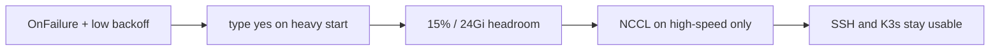
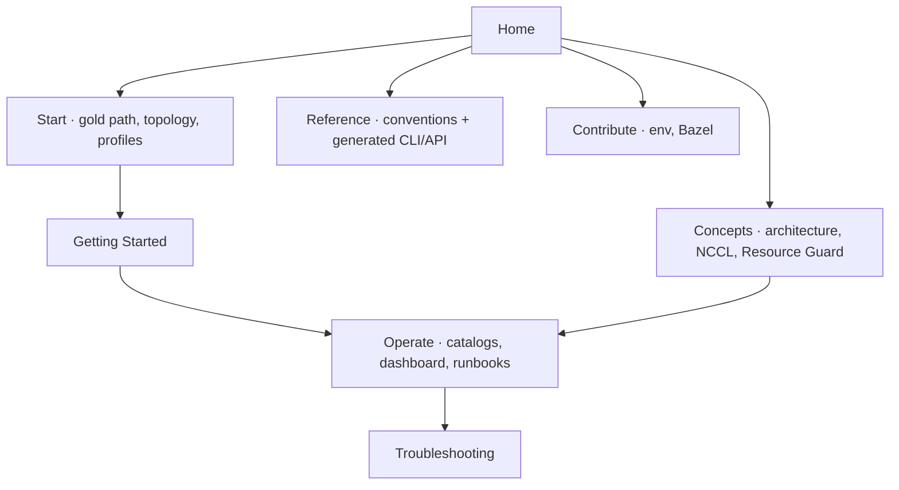

# nvidia-dgx-spark-lab

**What's on this page**

- What this lab is (and is not)
- Four starting paths: first cluster, run a model, operate safely, recover
- Default stack and the safety table that protects SSH
- Documentation map for Start / Concepts / Operate / Reference

**What this enables**

- Finding the right page in one screen instead of scrolling a dump
- Bringing up a 1–5 node DGX Spark K3s lab without auto-starting heavy jobs
- Knowing when to stay here versus using the Compose Comfy sibling

This is a **K3s lab** for 1–5 [NVIDIA DGX Spark](https://docs.nvidia.com/dgx/dgx-spark/hardware.html) nodes — single node, 200 Gb/s QSFP pair, QSFP ring, or a Mikrotik CRS804 switch fabric (4–5 nodes). Workloads are Kubernetes Jobs and Deployments with explicit resources. Nothing heavy starts on reboot. Any of the Sparks can run the control plane.

Single-node **Compose** ComfyUI lives in [ez-comfy-stack](https://github.com/toxicoder/ez-comfy-stack). Visual generative AI **in this repo** is `k8s/workloads/comfy-*` plus `scripts/lib/visual.sh` — see [Visual generative AI](visual-generative-ai.md).

---

## Choose a path

<Cards>
  <Card title="First cluster">
    ---

    Topology file → cloud-init → Ansible bootstrap → GPU Operator → `doctor` → `kimi-test`.

    [Getting Started](getting-started.md)
  </Card>
  <Card title="Run a model">
    ---

    Pick kimi-test, a daily stack, exclusive Mode B/C, visual Comfy, or agents — after capacity checks.

    [Profiles](start/profiles.md)
  </Card>
  <Card title="Operate safely">
    ---

    Resource Guard 15% / 24Gi, overlays, capacity math, reboot, secrets, dashboard.

    [Resource Guard](resource-guard.md)
  </Card>
  <Card title="Something broke">
    ---

    `doctor` first. SSH hang, scheduler, NCCL iface, mode collision, Grafana, dashboard.

    [Troubleshooting](troubleshooting.md)
  </Card>
</Cards>

Contributors: [Contribute](contribute/index.md) · [Project conventions](project-conventions.md). Topology (1–5 nodes, fabric, orchestrator): [Choose topology](start/choose-topology.md).

---

## Default stack

| Item | Value |
| --- | --- |
| Runtime | K3s + NVIDIA GPU Operator |
| First workload | **kimi-test** (`start-test`) — always before heavy Jobs |
| Inference | Jobs, `restartPolicy: OnFailure`, low `backoffLimit` |
| Capacity | Resource Guard — `config/resource-policy.yaml` |
| Headroom | **max(24Gi, 15% of allocatable)** per node |
| GPU util | Mode A vLLM ≤ 0.82; Mode B exclusive ≤ 0.85; Mode C SGLang ≤ 0.95. Never ship vLLM 0.88/0.90 |
| Visual | Manual ComfyUI Deployments, one at a time |
| Docs | Fumadocs on Next.js; `bazelisk run //docs:docs` |

## Safety first

<Callout type="warning" title="Remote Spark rules">
  These defaults protect SSH and the control plane on remotely managed GB10 nodes. Do not weaken them for demos.
</Callout>
| Guard | Behavior |
| --- | --- |
| **No auto-start** | Heavy inference never returns after reboot |
| **Heavy confirmation** | Type `yes` or set `LAB_CONFIRM_TOKEN=yes` |
| **Headroom preflight** | Resource Guard blocks starts when free GPU/CPU/RAM is too low |
| **High-speed NCCL only** | Multi-node Jobs pin `NCCL_*` to the fabric — never copy 2-node pair env onto a 3-node QSFP ring |

Why those exist: [Learn the lab](learn/index.md) · [Reboot safety](reboot-safety.md) · [Resource Guard](resource-guard.md).

---

## Documentation map

**Start here:** [Getting Started](getting-started.md) is the gold path (numbered steps, verify after every phase, 1-node vs multi-node tabs, Bazel-first commands).

This site is built with [Fumadocs](https://fumadocs.com) on Next.js. Shell reference is generated from `# ##` / `# @command` comments via `bazelisk run //docs:docs`.
