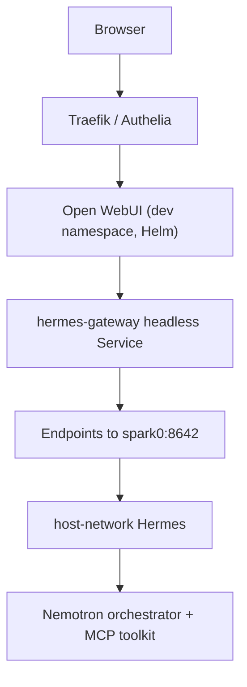

# Open WebUI (Agent Chat)

<ClusterConfigPanel />

**What's on this page**

- Prerequisites and deploy paths for the Open WebUI Helm stack
- Hermes gateway backend wiring and SSO exposure options
- Policy configuration and operational commands

**What this enables**

- Browser chat UI backed by Hermes MCP orchestration on the lab cluster
- A polished agent surface without bypassing existing safety gates

Deploy [Open WebUI](https://github.com/open-webui/open-webui) as a polished chat surface for lab AI agents. Conversations route through the **Hermes gateway** (`:8642/v1`) for MCP tools (SearXNG, fetch, memory, Context7, etc.), and through **LiteLLM** (`http://litellm.ai-inference.svc.cluster.local:4000/v1`) for model aliases. The UI default model is **`lab-auto`**, which follows whichever LiteLLM backend profile is active (`start-qwen38-27b --with-litellm`, Mode A rounded, Mode B, or Mode C). See [litellm-rounded-stack.md](litellm-rounded-stack.md).

Raw vLLM Services (`http://<job>.ai-inference.svc.cluster.local:8000/v1`) remain a debug bypass — do not point the UI at them for daily use. Do not add a cloud OpenAI medical backup for `lab-med`.

## Prerequisites

Bring up the agent stack before Open WebUI:

```bash
bazelisk run //scripts:run-utility -- nemotron-stack start nemotron-agentic-spark-1 --confirm yes
bazelisk run //scripts:run-utility -- mcp-stack start mcp-agent-toolkit --confirm yes
./scripts/manage.sh start-hermes
```

## Deploy (standalone)

```bash
./scripts/manage.sh start-open-webui
# or
bazelisk run //scripts:run-utility -- open-webui-stack start open-webui-lab --confirm yes
```

Stop:

```bash
./scripts/manage.sh stop-open-webui
```

Open WebUI is **not** auto-started with `start-monitoring` or `start-hermes`.

## Access

| Mode | URL |
|------|-----|
| SSO (recommended) | `https://chat.lab.local:32443` |
| NodePort bypass | `http://<spark0-ip>:32085` |

Add `chat.lab.local` to `/etc/hosts` (see [sso.md](sso.md)).

Traefik forward-auth protects the SSO route. Open WebUI trusts the `Remote-User` header from Authelia for account mapping.

## Architecture



The `hermes-gateway` Endpoints IP is rendered at deploy time from the control-plane node InternalIP (`LAB_SPARK0_IP` override supported).

## Dashboard

The lab portal **Agent Chat** panel shows prerequisites, deploy/stop controls, and launch links.

## Troubleshooting

| Symptom | Cause | Action | Prevention | Verify |
| --- | --- | --- | --- | --- |
| Start fails: Hermes not running | Gateway down | `bazelisk run //:manage -- start-hermes` | Start Hermes before Open WebUI | curl `:8642/v1/models` |
| Gateway not reachable from pod | Endpoints IP stale after node IP change | Re-run `start-open-webui` | Re-apply after spark0 address change | `kubectl get endpoints hermes-gateway -n dev` |
| 401 from Hermes | `API_SERVER_KEY` drift | stop/start Open WebUI (reads `hermes/data/.env`) | Do not hand-edit the K8s Secret | chat models list |
| Models empty | LiteLLM/Hermes empty | Confirm backends; start LiteLLM with `--backend` or `--with-litellm` if you expect `lab-auto` | [LiteLLM rounded stack](litellm-rounded-stack.md) | `/v1/models` |
| Default chat 503 | LiteLLM down or profile backend Job not Ready | `start-litellm --backend …` then start the matching Job | Open WebUI warns if LiteLLM is not Ready; does not hard-fail | `/v1/models` on `:4000` |

```bash
bazelisk run //:manage -- start-open-webui
bazelisk run //:manage -- stop-open-webui
```

## Related

- [hermes-agent.md](hermes-agent.md) — gateway and MCP wiring
- [mcp-agent-toolkit.md](mcp-agent-toolkit.md)
- [nemotron-agentic-stack.md](nemotron-agentic-stack.md)
- `config/open-webui-policy.yaml`