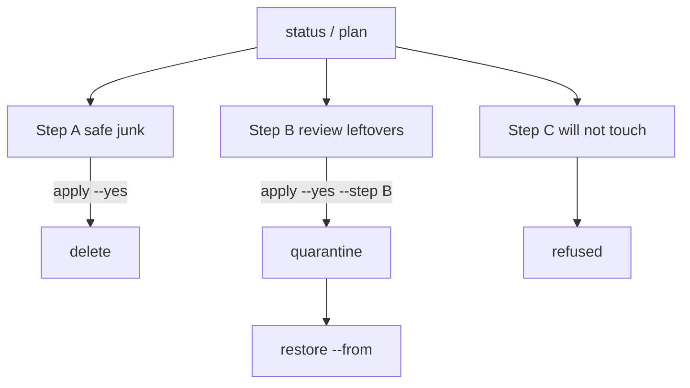

# Disk wizard

**What's on this page**

- What the wizard will and will not touch
- How it differs from `cleanup` and the dashboard Storage treemap
- Time-crunch recipe when the NVMe is full
- Restore from quarantine

**What this enables**

- Freeing leftover HF blobs, pip caches, and interrupted downloads **without** deleting lab keep-set weights
- Seeing *why* a path is large before you act
- Refusing in-use files (open fds, pod hostPath, running Jobs)

<ClusterConfigPanel />

<Callout type="error" title="Default is read-only">
  `status`, `plan`, `recommend`, `largest`, `explain`, and dashboard **Run** never delete.
  `apply` requires `--yes`. Review leftovers quarantine. Dangerous paths are refused entirely.
  The wizard never runs `docker system prune -a --volumes`.
</Callout>

## When to use this

Spark NVMe is the scarce resource. Official units ship **1 TB or 4 TB** on the same partition as `/`. One frontier checkpoint is 100–500 GB. Hugging Face hub cache, K3s containerd, and interrupted `hf download` leftovers fill the disk while Resource Guard is still happy about RAM.

NVMe is **per node**. Run the wizard on each Spark. There is no remote apply.

```bash
bazelisk run //scripts:run-utility -- disk-wizard status
bazelisk run //:manage -- disk-wizard plan
bazelisk run //:manage -- disk-wizard recommend --target-gib 50
```

Classic: `./scripts/utilities/disk-wizard.sh status`.

## Three tools (do not mix them up)

| Tool | Scope | Default | Deletes weights? |
| --- | --- | --- | --- |
| `manage.sh cleanup` | Inference / dev **namespaces** | type `DELETE` | **No** |
| Dashboard Storage | Treemap of `/mnt/models` (allow-listed) | confirm, move to `/tmp/lab-trash` | Yes, allow-listed paths |
| `disk-wizard` | Host leftovers (HF hub, caches, tmp dumps, MODELS_DIR junk) | plan / status | Safe junk after `apply --yes`; review-class **quarantines** |

## Time-crunch recipe

1. `disk-wizard status` — pressure `ok` / `warn` / `crit` from `df` (fast; no NVMe walk).
2. `disk-wizard recommend --target-gib N` — smallest **safe** set, then review with redownload warnings. `largest` finds surprise directories.
3. Read Step C. Keep-set, Engram (`/mnt/models/dsv41-engram`), k3s server data, and in-use files are never offered.
4. `disk-wizard apply --yes` — Step A only (safe junk).
5. Only then `disk-wizard apply --yes --step B` — quarantine review leftovers.



TTY with no flags opens an interactive menu (`status`, `plan`, `recommend`, `largest`, `explain`, apply A/B). Apply still requires typing `yes` — a single keypress never deletes.

`status` / dashboard **Run** stay fast (df + last plan). They do **not** walk the NVMe. Use `plan`, `recommend`, or `largest` to measure leftovers.

## What is classified

Signatures live in `config/disk-catalog.yaml` (restricted YAML, no PyYAML).

| Class | Typical location | Risk |
| --- | --- | --- |
| Interrupted HF download `*.incomplete` | `/mnt/models`, `~/.cache/huggingface` | Safe delete (refused while `hf` is running) |
| pip / uv wheel cache | `~/.cache/pip`, `~/.cache/uv` | Safe delete |
| Core dumps | `/tmp`, `/var/tmp` | Safe delete |
| Complete HF hub repo not in keep-set | `~/.cache/huggingface/hub/models--*` | Review (quarantine; hours to re-download) |
| Ollama blobs, torch / vLLM / SGLang caches | `~/.ollama`, `~/.cache` | Review |
| Unused containerd images | `k3s crictl` | Review, **plan-only** |
| Lab keep-set checkpoints | documented `download-*` dests | Dangerous, never |
| DeepSeek Engram tables | `/mnt/models/dsv41-engram` | Dangerous, never |
| K3s server / etcd | `/var/lib/rancher/k3s/server` | Dangerous, never scanned as reclaim |
| Factory `*bittest*` leftover | volume root glob only | Review; `--confirm-token BITTEST` |
| Triton / torch_extensions / CUDA compute cache | `~/.triton`, `~/.cache`, `~/.nv` | Review (quarantine) |
| Docker named volumes / containers | `docker system df` | Dangerous, never |

Keep-set prefixes are the documented download targets (rounded stack, Qwen, FLUX, LTX, DeepSeek-V4.1-Flash, GLM GGUF, MedGemma). Incomplete files *inside* a keep-set tree are still junk.

Hugging Face hub layout (`blobs/` + `snapshots/` + `*.incomplete`) is why `du` on a repo is larger than `hf cache ls`. `atime` is **not** trusted (NVMe is often `noatime`). Recency hints use `refs/` mtime or a `last_accessed` file, never atime. In-use means an open fd/mmap, a pod `hostPath`, a live Job, or an `hf` / `huggingface-cli` process.

## K3s images (manual)

containerd leftovers are listed, never pruned automatically. After you confirm no Job needs the image:

```bash
sudo k3s crictl rmi --prune
```

Do **not** run `docker system prune -a --volumes`. That deletes named volumes and is refused in this tool.

Comfy PVC `comfy-state` is not on hostPath. Stop visual with `stop-visual` if you need that space; the wizard will not delete the PVC.

## Restore

Review apply moves trees to `MODELS_DIR/.disk-quarantine/<utc>` or `~/.lab-disk-quarantine/<utc>` **on the same filesystem** (`mv`, not copy). Manifest records the original path.

```bash
bazelisk run //:manage -- disk-wizard restore --from /mnt/models/.disk-quarantine/20260919T120000Z
```

## Dashboard

Utilities **Status** / **Run** call `status --json` / `run`. Both set `"apply": false`. Destructive apply stays on the node CLI.

## Safety

Does not change Resource Guard, restartPolicy, NCCL, or download utilities. `cleanup` still requires typing `DELETE`.
