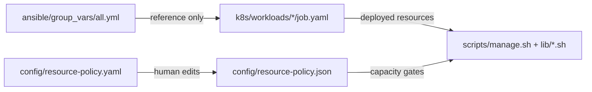

# Project Conventions & Style Guide

**What's on this page**

- Core principles and sources of truth for the lab
- Cross-stack naming, formatting, and linting rules
- Patterns for shell scripts, Kubernetes, Ansible, config, and the dashboard
- Documentation, testing, change discipline, and enforced safety invariants
- Quick-reference checklists for common tasks

**What this enables**

- One place to learn how this repository is structured and why
- Consistent contributions without hunting through scattered READMEs
- Safer changes to workloads, scripts, and manifests by following enforced patterns

This document is the **canonical reference** for human contributors. Stack-specific addenda extend it:

- [dashboard/AGENTS.md](https://github.com/toxicoder/nvidia-dgx-spark-lab/blob/main/dashboard/AGENTS.md) — Next.js dashboard details
- [scripts/README.md](https://github.com/toxicoder/nvidia-dgx-spark-lab/blob/main/scripts/README.md) — `manage.sh` and utility scripts
- [tests/README.md](https://github.com/toxicoder/nvidia-dgx-spark-lab/blob/main/tests/README.md) — test targets and mocks
- [CONTRIBUTING.md (repo root)](https://github.com/toxicoder/nvidia-dgx-spark-lab/blob/main/CONTRIBUTING.md) — short contribution hub
- [CONTRIBUTING.md](CONTRIBUTING.md) — MkDocs prose and formatting rules

AI coding agents should also read [AGENTS.md](https://github.com/toxicoder/nvidia-dgx-spark-lab/blob/main/AGENTS.md) for workflow-specific guidance.

---

## 1. Core principles

These principles override convenience. When in doubt, choose stability and explicit control.

| Principle | What it means |
| --- | --- |
| **Stability first** | SSH, K3s, and the dashboard must stay responsive under heavy GPU load. |
| **Explicit resources** | Every heavy workload has `resources.requests` and `resources.limits`. |
| **No auto-start** | Heavy inference Jobs never start on reboot. Operators start them deliberately. |
| **Low backoff** | Production inference Jobs use `restartPolicy: OnFailure` (or `Never`) with a low `backoffLimit`. |
| **High-speed NCCL** | Multi-node workloads set `NCCL_SOCKET_IFNAME` and related vars for dual 400G links. |
| **Test before production** | Lighter `*-test` variants validate clusters before heavy `kimi`-class jobs. |
| **Defense in depth** | Policy files, runtime checks, Kubernetes guardrails, and static greps all enforce safety. |
| **Hermetic tests** | Tests run on any clone without real DGX hardware or a live cluster. |
| **Docs as code** | Command reference and API docs are generated from structured source comments. |
| **Bazel-first** | Builds, tests, lint, docs, and launchers go through Bazel (`bazelisk`). |

See also [reboot-safety.md](reboot-safety.md), [resource-guard.md](resource-guard.md), and the root [README.md](https://github.com/toxicoder/nvidia-dgx-spark-lab/blob/main/README.md).

### DGX Spark hardware (reference)

Official per-node specs ([NVIDIA DGX Spark hardware](https://docs.nvidia.com/dgx/dgx-spark/hardware.html)):

| Resource | Per node (GB10) | 2-node lab |
| --- | --- | --- |
| GPU | 1× Blackwell (GB10) | **2 GPUs** allocatable |
| CPU | 20-core Arm | **~28 cores** allocatable after kubelet reserve |
| Memory | **128 GB** unified | **~112 Gi** allocatable after kubelet reserve |
| Network | ConnectX-7, dual ~400G | NCCL via `enp1s0f0np0,enp1s0f1np1` |

Kubelet reservations (Ansible `k3s_kubelet_reserved_args`): `system-reserved=cpu=4,memory=64Gi` + `kube-reserved=cpu=2,memory=8Gi` per node. Resource Guard adds **15% / 64Gi minimum headroom per node** (`config/resource-policy.yaml`).

**Manifest vs hardware:** Some manifests and policy entries model aggregate multi-node GPU counts for larger clusters. On a **2× Spark** lab, only **2 GPUs** are physically allocatable — mocks, capacity checks, and dashboard fixtures should use realistic Spark numbers.

---

## 2. Sources of truth

Understand which file is authoritative before editing.



| Layer | Authoritative for | Notes |
| --- | --- | --- |
| `k8s/workloads/*/*.yaml` | Deployed CPU/GPU/memory, restart policy, NCCL env | Auditable; preferred for inference |
| `config/resource-policy.json` | Model/stack registry, capacity math, tier definitions | Parsed by scripts and dashboard |
| `config/resource-policy.yaml` | Human-readable policy (SoT for JSON twin) | Edit YAML, keep JSON in sync |
| `ansible/inventory/group_vars/all.yml` | Bootstrap defaults, chart versions, NCCL reference | **Reference only** — not deployed resource limits |
| `config/nemotron-catalog.yaml` | Display names, HF paths, agent roles | Capacity deferred to resource-policy |
| `scripts/manage.sh` + `lib/*.sh` | Runtime behavior, confirmations, apply order | Structured comments feed generated docs |
| `*.example.yaml` | Secret templates | Never commit real secrets |

**Policy twins:** Most policy files have a YAML (human) + JSON (machine) pair. When you change one, update the other and extend `tests/safety_invariants.sh` if you add models or stacks.

---

## 3. Naming conventions

### Files and directories

| Area | Pattern | Examples |
| --- | --- | --- |
| Directories | `kebab-case` | `kimi-test`, `nemotron-3-ultra`, `open-webui` |
| K8s manifests | `<workload>-job.yaml` or `<workload>-deployment.yaml` | `kimi-test-job.yaml` |
| Shell libs | `scripts/lib/<domain>.sh` | `models.sh`, `resources.sh`, `mcp.sh` |
| Utilities | `scripts/utilities/<kebab-name>.sh` | `spark-clock.sh`, `mcp-stack.sh` |
| BATS tests | `tests/bats/<area>.bats` | `manage.bats`, `utilities.bats` |
| Dashboard panels | `components/<Feature>Panel.tsx` | `InferencePanel.tsx` |
| Dashboard clients | `*Client.tsx` when split from RSC wrapper | `MachineStateClient.tsx` |
| Server actions | `actions/<domain>-actions.ts` | `host-actions.ts` |
| Services | `lib/services/<domain>.ts` | `docker.ts`, `nemotron-stack.ts` |
| Zod schemas | `<Thing>Schema` in `lib/validation.ts` | `ContainerIdSchema` |
| Ansible playbooks | `playbooks/<verb>-<noun>.yml` | `bootstrap-cluster.yml` |
| Helm values | `ansible/files/<chart>-values.yaml` | `traefik-values.yaml` |

### Kubernetes metadata

```yaml
metadata:
  name: kimi-test          # matches directory / workload id
  namespace: ai-inference  # inference workloads
labels:
  app: kimi-test
  workload: inference
  mode: test               # optional
  runtime: nim             # agent deployments
```

Base kustomization adds:

```yaml
commonLabels:
  app.kubernetes.io/part-of: nvidia-dgx-spark-lab
  app.kubernetes.io/managed-by: kustomize
```

### Shell functions

| Visibility | Pattern | Examples |
| --- | --- | --- |
| Public helpers | verb noun | `start_kimi`, `check_capacity`, `ensure_namespace` |
| Private helpers | `_prefix` | `_hermes_load_policy_json` |
| Utility subcommands | `cmd_*` or plain `status`/`run` | `cmd_status`, `cmd_start` |

### Ansible inventory

- Hosts: `spark0`, `spark1`, …
- Groups: `k3s_server`, `k3s_agent`, `k3s_cluster`

### Priority classes and quotas

- Priority classes: `lab-critical`, `lab-management`, `lab-optional`, `lab-inference`
- Quotas: `lab-<tier>-quota` (e.g. `lab-inference-quota`)

---

## 4. Bazel-first workflow

Bazel is the **only official** build system. The `Makefile` is a thin compatibility shim.

### Daily commands

```bash
bazelisk run //:validate                    # git-aware: core + docs/dashboard slices
bazelisk run //:validate -- --all           # full suite before merge
bazelisk run //:fix                         # formatters + auto-fix linters
bazelisk test //:test-fast                  # CI core (safety + BATS + docs render)
bazelisk run //:manage -- status           # lab operations
bazelisk run //docs:docs                    # strict docs build
bazelisk run //docs:serve                   # live preview
```

### When to run what

| After editing | Run |
| --- | --- |
| Any source change (before PR) | `bazelisk run //:validate` |
| `BUILD.bazel` or `.bzl` | `bazelisk run //:fix` |
| Shell structured comments | `bazelisk run //docs:docs` |
| Dashboard JSDoc | `bazelisk run //dashboard:docs` |
| UI / visual changes | `bazelisk run //dashboard:hermetic-test` |

See [BUILDING_WITH_BAZEL.md](BUILDING_WITH_BAZEL.md) for targets, devcontainer setup, and CI details.

### Devcontainer

The `.devcontainer/` image includes bazelisk, buildifier, shfmt, ruff, mypy, ansible, kubectl, helm, shellcheck, bats, yamllint, Node.js 22, and Playwright. Use it for consistent tooling across platforms.

---

## 5. Formatting and linting

Run `bazelisk run //:fix` after sets of changes. Pure linters (shellcheck, kubeconform) have no safe auto-fix — run via `bazelisk test //:lint --test_tag_filters=manual`.

### Formatter settings

| Tool | Scope | Settings |
| --- | --- | --- |
| **buildifier** | `BUILD*`, `*.bzl` | `-mode=fix` |
| **shfmt** | `*.sh` | `-w -s -i 2 -ci` (2-space indent, simplify, indent case) |
| **ruff** | `docs/*.py`, root `*.py` | format + `check --fix` |
| **mypy** | all tracked `*.py` | `strict = true` per `mypy.ini`; `//lints:mypy` (manual) |
| **prettier** | dashboard TS/TSX/MD/JSON; repo YAML via `scripts/yaml_format.sh` | 2-space, 120 cols, double quotes (`prettier.config.mjs`) |
| **eslint** | dashboard | `no-explicit-any: error`; Next core-web-vitals |

### YAML linting

`.yamllint.yml`: 2-space indent, 120-char line length (warning), `document-start: disable`. Helm templates and Jinja (`.j2`) are excluded.

### Pre-commit (optional)

```bash
pip install --user pre-commit
pre-commit install
```

Hooks mirror Bazel lint tools: buildifier check, shfmt, shellcheck, prettier YAML, yamllint. See `.pre-commit-config.yaml`.

### TypeScript (dashboard)

- `strict: true`, `noImplicitAny`, `strictNullChecks`
- Path alias: `@/*` → dashboard root
- No explicit `any` (ESLint error)

---

## 6. Shell scripts

### Baseline

Every script starts with:

```bash
#!/usr/bin/env bash
set -euo pipefail
```

Resolve paths explicitly:

```bash
SCRIPT_DIR="$(cd "$(dirname "${BASH_SOURCE[0]}")" && pwd)"
REPO_ROOT="$(cd "$SCRIPT_DIR/.." && pwd)"
```

Source `lib/common.sh` for `log`, `warn`, `err`, and tool requirements. Utilities may redefine logging with a utility-specific prefix (e.g. `[spark-clock]`).

### `manage.sh` architecture

- **Thin dispatcher:** large `case` on `$1` delegates to `lib/*.sh` functions
- **Preflight:** `require_kubectl` + `check_cluster_access` on mutating commands
- **Kubeconfig:** auto-sets `KUBECONFIG` if `${REPO_ROOT}/kubeconfig/config` exists
- **Default:** `help` when no args

Libs loaded in fixed order: `common.sh`, `check_tool.sh`, `domains.sh`, `resources.sh`, `models.sh`, and domain modules (`mcp.sh`, `hermes.sh`, `dev.sh`, etc.).

### Structured documentation comments

The docs generator (`docs/generate_shell_docs.py`) extracts these markers:

```bash
# ## Section Title
# Multi-line description with safety notes and examples.
#
# Usage:
#   bazelisk run //:manage -- start-test
#
# Safety:
#   Requires typing yes for heavy models.

# @command start-test
# Short description of the command.

# @function start_workload
# Description of the helper function.
```

Over-document in comments. The generated [shell reference](generated/shell/reference.md) is the public API surface.

### Utility scripts pattern

Utilities in `scripts/utilities/` must implement:

| Subcommand | Contract |
| --- | --- |
| `status [--json]` | Read-only; exit 0 when healthy/done |
| `run` | Idempotent — no-op if already correct |

Additional rules:

- Source `lib/common.sh`
- Use structured comments (appear in generated docs automatically)
- **Never touch inference workloads** (except dedicated stack utilities that go through Resource Guard)
- Discoverable via Bazel `//scripts:run-utility`, dashboard Utilities panel, and docs generator

```bash
bazelisk run //scripts:run-utility -- spark-clock status
bazelisk run //scripts:run-utility -- spark-clock run
```

### Error handling

| Pattern | Behavior |
| --- | --- |
| `require_kubectl`, `require_helm`, `require_jq` | `err` + `exit 1` |
| Read-only probes | `\|\| true` tolerance |
| Unknown subcommand | `err` + usage hint + `exit 1` |
| Destructive ops (`cleanup`) | Require typing `DELETE` |
| Heavy starts | Interactive `yes` prompt or `LAB_NON_INTERACTIVE=1` + `LAB_CONFIRM_TOKEN=yes` |

### Resource Guard integration

- `check_capacity`, `enforce_capacity`, `require_heavy_confirm` in `lib/resources.sh`
- Policy from `config/resource-policy.json`
- Hermetic test env: `LAB_MOCK_NODES_JSON`, `LAB_MOCK_PODS_JSON`
- `guard_active_job` refuses start when job already active

### macOS compatibility

`models.sh` avoids bash 4 associative arrays for `/bin/bash` 3.2 compatibility; uses `case` lookup instead.

---

## 7. Kubernetes and Kustomize

### Directory layout

```text
k8s/
├── base/                    # Namespaces, Resource Guard, common labels
├── overlays/{prod,test,single-node}/
├── workloads/<name>/        # Atomic unit per model/service
├── auth/, cert-manager/, traefik/
└── dev/                     # Dashboard, open-webui, Coder templates
```

### Layering model

1. **`k8s/base/`** — shared namespaces, PriorityClass, ResourceQuota, LimitRange, PDB
2. **`k8s/workloads/<name>/`** — job/deployment + service + `kustomization.yaml` + `README.md` + `BUILD.bazel`
3. **`k8s/overlays/<env>/`** — references workloads, applies strategic-merge patches

| Overlay | Purpose |
| --- | --- |
| `test` | Lighter resources (`patches/test-resources.yaml`) |
| `single-node` | TP=1, 1 GPU (`patches/single-node-tensor-parallel.yaml`) |
| `prod` | Production workload references (values in base YAML) |

### Helm vs raw YAML

| Component | Mechanism | Why |
| --- | --- | --- |
| lab-dashboard, Coder, Kasm, Grafana, Traefik, Authelia | Helm (values in `ansible/files/`) | Operational tooling; versioned upgrades |
| kimi, nemotron, ray, qwen, glm | Raw YAML + kustomize | Auditable resources, restart policy, backoff |
| comfy-base, flux-*, ltx-*, flux-to-ltx | Raw YAML + kustomize overlays | Long-lived Deployments; shared PVC + hostPath models |

### Visual ComfyUI workloads

| Pattern | Convention |
| --- | --- |
| Base runtime | `k8s/workloads/comfy-base/` |
| Overlays | `k8s/workloads/comfy-visual/<family>/<mode>/` |
| Labels | `workload: visual`, `runtime: comfyui`, `family: flux\|ltx\|…` |
| Policy | `kind: deployment`, `heavy: true`, GPU 1 |
| Lifecycle | `scripts/lib/visual.sh` + `manage.sh` visual commands |
| Downloads | `scripts/utilities/download-flux.sh`, `download-ltx.sh` (`status`/`run`) |
| Exclusivity | One visual Deployment at a time; `stop-visual` clears all |
| Docs | [visual-generative-ai.md](visual-generative-ai.md) |

### ConfigMap scripts (mandatory — no inline bodies)

**Never** embed shell or Python in ConfigMap `data:` multi-line blocks (`foo.sh: |`, `bar.py: |`). That bypasses shellcheck, shfmt, mypy, and `# @function` gates.

**Required pattern** (same as `mcp/k8s/workloads/*` and `k8s/workloads/comfy-base/`):

1. Put the script in a real file next to the kustomization (e.g. `scripts/install-comfy.sh`).
2. Reference it from `kustomization.yaml` via `configMapGenerator` + `files:`.
3. Set `disableNameSuffixHash: true` when Deployments pin a fixed ConfigMap name.
4. Keep full YAML headers on the kustomization; document the script with `# ##` / `# @function` like any other shell.

```yaml
configMapGenerator:
  - name: comfy-base-scripts
    files:
      - install-comfy.sh=scripts/install-comfy.sh
      - run-comfy.sh=scripts/run-comfy.sh
    options:
      disableNameSuffixHash: true
```

Enforced by `//tests:doc_coverage` (`no inline ConfigMap scripts`). Workflow JSON and plain config literals are fine; only `*.sh` / `*.bash` / `*.py` embeds are banned.

### Workload README template

Every workload directory includes a `README.md` with:

- **What's on this page** / **What this enables** sections
- Purpose, safety features, usage via `manage.sh`
- Resource/backoff/restart policy notes
- Links to related workloads and docs

Duplicate the [kimi-test](https://github.com/toxicoder/nvidia-dgx-spark-lab/tree/main/k8s/workloads/kimi-test) pattern for new workloads; scale resources upward only after validation.

### Job safety fields (required)

```yaml
spec:
  backoffLimit: 1          # low for heavy production jobs
  template:
    spec:
      restartPolicy: OnFailure   # never Always for heavy inference
      containers:
        - resources:
            requests: { ... }
            limits: { ... }
          env:
            - name: NCCL_SOCKET_IFNAME
              value: enp1s0f0np0,enp1s0f1np1
```

Production `kimi` also requires `securityContext`, `readinessProbe`, and `livenessProbe`.

### Bazel integration

Each workload/overlay has `BUILD.bazel` with `filegroup` targets and scoped `visibility` to `//k8s`, `//tests`, `//scripts`, `//lints`. `tests/kustomize_build.sh` smoke-tests overlays.

### Secrets

- Commit only `*.example.yaml` templates
- Real secrets via dashboard vault or `manage.sh secrets` at runtime

---

## 8. Ansible

### Structure

```text
ansible/
├── playbooks/           # Orchestration entry points
├── roles/<role>/tasks/main.yml
├── files/*-values.yaml  # Committed Helm values for third-party charts
└── inventory/group_vars/all.yml
```

### Playbook headers

```yaml
---
# ## playbook-name.yml
#
# Description, usage, safety notes.
#
# @playbook playbook-name
```

Meta playbook `full-lab-setup.yml` chains via `import_playbook:` with `when:` guards. **Heavy inference is never auto-started.**

### Role pattern

- Single `tasks/main.yml` per role
- Header comment with `@role <name>`
- Idempotent tasks: `creates:` or `changed_when:` logic
- Helm: `helm repo add ... || true` + `helm upgrade --install ... --wait`

### Roles map

| Role | Responsibility |
| --- | --- |
| `k3s_common` | OS prep, swap, sysctls |
| `gpu_operator` | NVIDIA GPU Operator Helm |
| `highspeed_network` | netplan + dual 400G |
| `coder`, `kasm`, `monitoring`, `traefik`, `sso` | Helm stacks |
| `labels` | Node labels for scheduling |

### Invocation

```bash
bazelisk run //ansible:bootstrap -- -i inventory/hosts.ini
bazelisk run //ansible:validate
```

Classic `ansible-playbook` remains supported. See playbooks for direct usage.

---

## 9. Config and policy files

### File pairs

| YAML (human SoT) | JSON (machine) | Consumed by |
| --- | --- | --- |
| `resource-policy.yaml` | `resource-policy.json` | `lib/resources.sh`, dashboard, safety tests |
| `open-webui-policy.yaml` | `open-webui-policy.json` | `lib/open-webui.sh` |
| `lab-domains.yaml` | `lab-domains.json` | `lib/domains.sh`, render-domains, SSO/TLS manifests |
| `sso-policy.yaml` | — | `lib/sso.sh`, Ansible SSO role (routes; domains in lab-domains) |

### `resource-policy.yaml` top-level keys

```yaml
headroom:     # cpu_percent, memory_percent, per-node minimums
tiers:        # critical | management | optional_dev
inference:    # namespace, priority_class
models:       # gpus, memory, cpu, heavy, job_name per model
stacks:       # nemotron-agentic, open-webui-lab, hermes presets
```

### Adding a new model

1. Create `k8s/workloads/<model>/` with job, service, kustomization, README, BUILD.bazel
2. Add entry to `config/resource-policy.yaml` and `.json`
3. Add `start-<model>` to `manage.sh` / `lib/models.sh`
4. Register model name in `tests/safety_invariants.sh` registry loop
5. Add BATS coverage for start/stop if behavior is non-trivial

### `nemotron-catalog.yaml`

Human-facing catalog only (display names, HF paths, ports). Do not put capacity math here — use `resource-policy.yaml`.

---

## 10. Dashboard (Next.js)

See [dashboard/AGENTS.md](https://github.com/toxicoder/nvidia-dgx-spark-lab/blob/main/dashboard/AGENTS.md) for file-level detail. Summary of enforced patterns:

### Stack

- Next.js 16+ App Router, `output: "standalone"`
- shadcn/ui + Radix (Dialog, Sheet, Select) + Sonner toasts
- MD3 design tokens in `globals.css`
- Drizzle + SQLite + better-auth

### Layering

```text
Request → middleware (cookie/proxy/bypass)
       → app/(dashboard)/layout (requireSession)
       → page.tsx (Promise.all reads via lib/host)
       → Panels (RSC or client + initial* props)
       → actions/* (requireSession + Zod)
       → lib/services/* (withMock in tests)
       → revalidatePath + toast
```

| Layer | Role |
| --- | --- |
| `app/(dashboard)/page.tsx` | Thin RSC composer — single `Promise.all` data load |
| `components/*Panel.tsx` | Feature UI; `*Client.tsx` when interactivity needed |
| `actions/*-actions.ts` | Server mutations; `"use server"` |
| `lib/services/*` | Host I/O; `withMock(mock, real)` for hermetic tests |
| `lib/validation.ts` | Central Zod schemas |
| `lib/types/index.ts` | Domain interfaces and string-literal unions |

### Server action pattern

1. `"use server"` at top
2. `await requireSession()` (or `requireSessionUser()` for audit)
3. `Schema.parse(...)` on all inputs
4. Delegate to `lib/host` or repositories
5. `revalidatePath("/")` after mutations

### Validation and security

- **Path safety:** `PathSchema` + `lib/path-security.ts` (`LAB_WHITELIST_BASES`)
- **Allow-lists:** `ALLOWED_UTILITIES` Set + `UtilityNameSchema`
- **Destructive confirms:** literal schemas (`HeavyConfirmSchema = z.literal("yes")`, `DeleteSecretSchema` with `"DELETE"`)
- **Auth:** middleware + layout + per-action `requireSession`; `AUTH_BYPASS`/`USE_MOCKS` forbidden in production

### UI rules

- Add shadcn components via CLI — do not hand-roll modals
- Overlays: Radix Dialog/Sheet only; toasts via Sonner
- Styling: `cn()` from `lib/utils.ts` (clsx + tailwind-merge)
- Test hooks: `data-testid` on panels and key rows
- Props: `initial*` prefix for server-hydrated data

### Testing

- **Canonical:** `bazelisk run //dashboard:hermetic-test` (Docker: Vitest + ESLint + typecheck + build + Playwright)
- **Local:** `bazelisk run //dashboard:test` (Vitest with `USE_MOCKS=1`)
- **Coverage:** 100% thresholds on actions, app, components, lib
- **Visual goldens:** `/dev/ui` and `/dev/panels` fixture routes (not production shell)

---

## 11. Documentation

### Documentation coverage (mandatory)

Every tracked source file must have stack-appropriate documentation. This is enforced by review, generators, and coverage gates — not optional polish.

| Stack | Required documentation | Typing |
| --- | --- | --- |
| **Shell** (`.sh`) | File-level `# ##` block; `# @command` on every `manage.sh` dispatch target and utility entrypoints; `# @function` on **every** function in `scripts/lib/`, `scripts/utilities/`, and workload scripts under `k8s/workloads/` / `mcp/` | N/A (bash) |
| **Python** (`.py`) | Module docstring; docstring on every `def` / `class` with Args, Returns, Raises | `from __future__ import annotations`; full param/return types |
| **TypeScript** (`.ts` / `.tsx`) | File-level module comment for services/actions; JSDoc on every exported function/class/component with `@param`, `@returns`, `@throws` | `strict: true`; explicit return types on exports |
| **YAML/YML** (K8s, Ansible, Helm, config) | Top-of-file `#` header: Purpose, Source of truth, Regenerate (or `n/a`), Safety | N/A |
| **BUILD.bazel** | Package-purpose `"""Package purpose: ..."""` docstring at top | N/A |
| **Markdown** (`docs/`) | YAML frontmatter + "What's on this page" / "What this enables" (see below); **every** page listed in `mkdocs.yml` `nav` must also be in `docs/BUILD.bazel` data (`//docs:serve`, `//docs:docs`, `_RENDER_TEST_DATA`) | N/A |
| **ConfigMap-mounted scripts** | Real files + `configMapGenerator` `files:` only — never inline `*.sh`/`*.py` in ConfigMap `data:` | N/A |

**Exceptions:**

- `*/generated/*` — auto-header from render scripts; do not hand-edit
- `components/ui/**` — shadcn generated; skip JSDoc
- `lib/mocks/**`, `lib/types/**` — test fixtures and type-only modules
- Embedded Python heredocs in shell — document via the enclosing `# @function`, not inline docstrings
- `k8s/dev/images/**` Docker entrypoints — outside the workload shell `# ##` / `@function` gate

**Coverage gates (fail `//:validate` / `//:test-fast`):**

| Gate | Enforces |
| --- | --- |
| `//tests:doc_coverage` | `@command` / `@function` / YAML headers / no inline ConfigMap scripts / mkdocs↔Bazel page lists / BUILD package purpose / dashboard JSDoc |
| `//tests:doc_coverage_unit` | Unit tests for the pure helpers behind those rules |
| `//lints:shellcheck` (manual lint suite) | Real `.sh` files only (another reason not to embed scripts in YAML) |

**Regenerate after API comment changes:**

```bash
bazelisk run //docs:docs          # shell reference
bazelisk run //dashboard:docs     # dashboard API
```

Hand-written docs live in `docs/` and are built with MkDocs Material. **Full prose rules** are in [CONTRIBUTING.md](CONTRIBUTING.md). Summary:

### Page structure (required)

Every `.md` page needs YAML frontmatter (`title`, `description`, `tags`) and two scannable sections after the title:

```markdown
**What's on this page**

- Bullets describing sections, diagrams, tables

**What this enables**

- Bullets on reader benefit
```

### Formatting rules

- Headings start at `##` inside pages (title from frontmatter)
- **All code fences must specify a language** (`bash`, `yaml`, `text`, `mermaid`, etc.)
- Blank line before list items that follow prose ending in `:`
- Mermaid: quote node labels with `{{...}}`; prefer `flowchart TD`
- Use admonitions (`!!! warning`, `!!! info`) and tabs for alternatives
- **Links to repo-root files** (outside `docs/`): use full GitHub URLs — MkDocs `--strict` rejects `../` paths to non-doc files

### Generated reference

| Source | Generator | Output |
| --- | --- | --- |
| Shell `# ##` / `# @command` comments | `docs/generate_shell_docs.py` | `docs/generated/shell/reference.md` |
| Dashboard JSDoc | TypeDoc | `docs/generated/dashboard-api/` |

After changing structured comments: `bazelisk run //docs:docs`. Commit source comments; generated files are derived.

Preserve `{{PLACEHOLDER}}` tokens for the interactive command-vars panel on getting-started.

### Information architecture

- **Home / Getting Started** — new users
- **Concepts & Notes** — safety, resources, architecture
- **How-to Guides** — task-oriented (Bazel, Gitea, dev workspaces)
- **Reference** — generated refs, contributing, conventions

---

## 12. Testing

Tests must be **fast, deterministic, and hermetic**.

### Test-driven development

Default workflow for non-trivial changes:

1. **Red** — write or extend a failing test; confirm it fails for the right reason
2. **Green** — minimum production change to pass
3. **Refactor** — clean up while keeping tests green

| Area | Write tests in | Run during TDD |
| --- | --- | --- |
| Shell / `manage.sh` | `tests/bats/` | `bazelisk test //tests:bats_manage_test` |
| Dashboard | `dashboard/**/__tests__/` | `bazelisk run //dashboard:test` |
| Docs generator | `docs/test_*.py` | `bazelisk test //docs:test_generate_shell_docs` |
| K8s / safety | `tests/safety_invariants.sh` | `bazelisk test //:test-fast` |

### Test stacks

| Area | Tools | Key targets |
| --- | --- | --- |
| Shell | BATS + shellcheck | `//tests:bats_manage_test`, `//tests:bats_utilities_test` |
| Kubernetes | yamllint + kubeconform + safety greps | `//lints:k8s`, `//tests:safety_invariants` |
| Ansible | ansible-lint + syntax | `//ansible:validate` |
| Dashboard | Vitest + Playwright (Docker) | `//dashboard:hermetic-test` |
| Docs | mkdocs strict + visual goldens | `//docs:test_mkdocs_render` |

### BATS hermetic strategy

1. `mktemp -d` per test in `setup()`
2. Copy scripts to temp dir; mock `PATH` (fake `kubectl`, `helm`, etc.)
3. Set `REPO_ROOT`, `KUBECONFIG`, `LAB_MOCK_*`
4. `teardown`: `rm -rf "$TEST_TMP_DIR"`

A feature without a failing-then-passing test cycle is not complete for behavior changes.

See [tests/README.md](https://github.com/toxicoder/nvidia-dgx-spark-lab/blob/main/tests/README.md) for adding new tests.

---

## 13. Change discipline and PR checklist

A change is **not complete** until everything it touches is updated and validated.

### Required steps

1. Write or update **failing tests** (TDD red) for behavior changes
2. Implement **minimum production change** (TDD green)
3. Refactor while keeping tests green
4. Update **structured comments** (`# @command`, JSDoc) for generated reference
5. Update `BUILD.bazel` / visibility / data deps if targets change
6. Update affected prose: workload READMEs, `docs/*.md`, root `README.md` as needed
7. Regenerate docs when shell or dashboard API comments changed
8. Run `bazelisk run //:fix` then `bazelisk run //:validate`
9. **Call out safety impact** for workload, manifest, NCCL, restart policy, or resource changes

### PR checklist

- [ ] `bazelisk run //:validate` passes (or `--all` before merge)
- [ ] `bazelisk run //:fix` applied
- [ ] Tests added/updated for behavior changes
- [ ] New models registered in `resource-policy.json` + `safety_invariants.sh`
- [ ] Structured comments updated for new/changed commands
- [ ] `bazelisk run //docs:docs` passes if docs/comments changed
- [ ] Safety impact documented in PR description

Prefer editing the source of truth (comments, manifests, policy YAML) over duplicating prose elsewhere.

---

## 14. Non-negotiable safety invariants

Enforced by `tests/safety_invariants.sh` (in `//:test-fast`) and BATS. **Do not weaken these without explicit review.**

| Check | Expected |
| --- | --- |
| `restartPolicy` on inference Jobs | `OnFailure` or `Never` — **never `Always`** |
| `backoffLimit` on heavy jobs | Present; `kimi` uses `1` |
| `NCCL_SOCKET_IFNAME` | On kimi, nemotron, glm jobs |
| `resources:` | On all listed inference jobs and agentic Deployments |
| Ray workloads | `nvidia.com/gpu` in resources |
| `kimi` production | `securityContext`, `readinessProbe`, `livenessProbe` |
| Resource Guard manifests | `lab-management` PriorityClass, `lab-inference-quota` |
| Policy registry | Every registered model exists in `resource-policy.json` `models` |
| Open WebUI / Hermes | Policy files, ansible values, stack registration |

Run locally:

```bash
bazelisk test //tests:safety_invariants
bazelisk test //tests:bats_manage_test
```

Management script confirmations and Resource Guard gates must not be bypassed in production code paths.

---

## Quick-reference checklists

### Adding a new inference workload

1. Copy `k8s/workloads/kimi-test/` structure (job, service, kustomization, README, BUILD.bazel)
2. Set conservative `resources.requests`/`limits`, `restartPolicy: OnFailure`, low `backoffLimit`
3. Add NCCL env vars for multi-node workloads
4. Register in `config/resource-policy.yaml` + `.json`
5. Add `get_model_job` mapping and `start-<name>` in `lib/models.sh` / `manage.sh`
6. Add model to `tests/safety_invariants.sh` registry
7. Add BATS test with mocked `kubectl` if start logic is non-trivial
8. Write workload README with safety notes

### Adding a utility script

1. Create `scripts/utilities/<name>.sh` with `set -euo pipefail`
2. Implement `status [--json]` and idempotent `run`
3. Source `lib/common.sh`; add structured `# ##` / `# @command` comments
4. Do not touch inference workloads
5. Add BATS coverage in `tests/bats/utilities.bats`
6. Verify discovery: `bazelisk run //scripts:run-utility -- <name> status`

### Adding a dashboard panel

1. Create `components/<Feature>Panel.tsx` (RSC or client as appropriate)
2. Add data fetch to `page.tsx` `Promise.all` or fetch inside RSC panel
3. Add Zod schemas in `lib/validation.ts` for any mutations
4. Add server actions in `actions/` with `requireSession()` + `revalidatePath`
5. Add service in `lib/services/` with `withMock()` for tests
6. Add Vitest tests (100% coverage on new lib/actions code)
7. Add `data-testid` hooks; update visual fixtures if UI changes
8. Run `bazelisk run //dashboard:hermetic-test` before merge

### Adding a docs page

1. Create `docs/<name>.md` with frontmatter and required overview sections
2. Add to `mkdocs.yml` nav under the right section
3. Use language-tagged fences; blank line before lists
4. Run `bazelisk test //docs:test_mkdocs_render`

---

## Related links

- [CONTRIBUTING.md (repo root)](https://github.com/toxicoder/nvidia-dgx-spark-lab/blob/main/CONTRIBUTING.md) — short contribution hub
- [CONTRIBUTING.md (docs)](CONTRIBUTING.md) — MkDocs prose rules
- [AGENTS.md](https://github.com/toxicoder/nvidia-dgx-spark-lab/blob/main/AGENTS.md) — AI agent workflow
- [BUILDING_WITH_BAZEL.md](BUILDING_WITH_BAZEL.md) — Bazel targets and CI
- [resource-guard.md](resource-guard.md) — capacity policy deep dive
- [reboot-safety.md](reboot-safety.md) — stop-before-reboot procedures
- [generated shell reference](generated/shell/reference.md) — auto-generated commands