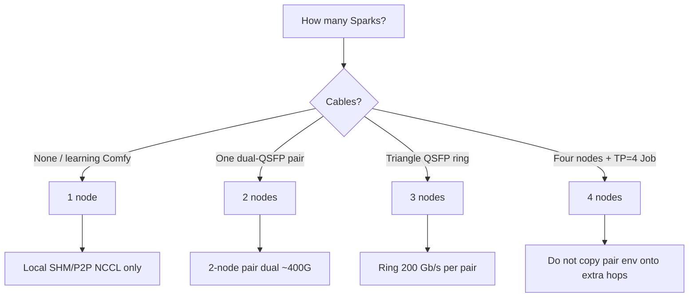

# Choose topology

**What's on this page**

- Decision tree for 1 / 2 / 3 / 4 nodes
- Which interconnect each size uses
- When **not** to add nodes
- Pointers to inventory and NCCL verification

**What this enables**

- Picking a size that matches cables, models, and operational risk
- Avoiding a 3-node QSFP ring configured with 2-node dual-400G `NCCL_*` env



## Roles

| Nodes | spark0 | spark1… | Fabric | Typical first Job |
| --- | --- | --- | --- | --- |
| **1** | control-plane + worker | — | none | `kimi-test` (local GPUs) |
| **2** | control-plane + worker | worker | dual QSFP ~400G aggregate | `kimi-test` then 2-node models |
| **3** | control-plane + worker | two workers | QSFP **ring** 200 Gb/s per pair | Mode A daily fleet or exclusive B/C |
| **4** | control-plane + worker | three workers | do not assume pair env | e.g. Qwen 397B NVFP4 TP=4 |

spark0 is always the K3s server. Agents join `k3s_agent`. Inventory: `ansible/inventory/hosts.ini.example`.

## Interconnect (do not mix)

**2-node pair** is what `ansible/inventory/group_vars/all.yml` `highspeed_*` / `nccl_env` documents:

- `NCCL_SOCKET_IFNAME=enp1s0f0np0,enp1s0f1np1`
- `NCCL_IB_HCA=mlx5_0,mlx5_1` (or live `ibdev2netdev` names)

**3-node QSFP ring** (Mode B GLM TP=3 and Mode C DeepSeek TP=3) is different:

- 200 Gb/s per physical port, triangle mesh, **not** NVLink
- Management / NCCL bootstrap on 10GbE (often `enP7s7`)
- Payload on all four CX-7 RoCE devices per node
- Jobs use `hostNetwork: true` and `hostIPC: true`

<Callout type="error" title="Do not copy 2-node NCCL env onto a 3-node ring">
  Wrong polarity or pair `NCCL_SOCKET_IFNAME` on a ring looks half-alive and dies in NCCL. See [Interconnect & NCCL](../concepts/interconnect-nccl.md) and [LiteLLM rounded stack](../litellm-rounded-stack.md).
</Callout>
**1 node:** ignore `highspeed` inventory; NCCL uses SHM/P2P on the local GPU.

## When not to multi-node

Stay on **one** Spark when:

- You are learning ComfyUI — use [ez-comfy-stack](https://github.com/toxicoder/ez-comfy-stack) (Compose) or this repo's **manual** visual Deployments on a single node
- The model is TP=1 (many Nemotron nano/super, Qwen3.6 dual, MedGemma)
- QSFP cables are missing, untested, or named differently than the Job env
- You cannot afford a fabric outage taking down an exclusive TP=3 Job

Add nodes only for models that **require** them (`multi_node_only` in `config/resource-policy.yaml`): GLM-5.2 RPC pair, Qwen 397B Spark2, Qwen 397B NVFP4 TP=4, GLM-5.3-Flash TP=3, DeepSeek-V4.1-Flash TP=3.

## Verify after you pick

```bash
ansible -i ansible/inventory/hosts.ini all -m ping
bazelisk run //ansible:verify -- -i inventory/hosts.ini
bazelisk run //:manage -- doctor
```

On 3-node ring also:

```bash
bazelisk run //:manage -- doctor-fabric
```

Inventory tabs and bootstrap: [Getting Started](../getting-started.md).
