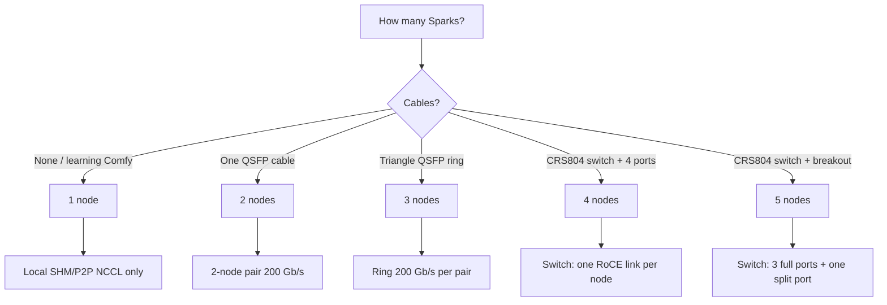

# Choose topology

**What's on this page**

- Decision tree for 1 / 2 / 3 / 4 / 5 nodes
- Which interconnect each size uses (including the Mikrotik CRS804 switch)
- How to pick which Spark runs the K3s control plane (the **orchestrator**)
- When **not** to add nodes
- Pointers to the declarative topology file, inventory, and NCCL verification

**What this enables**

- Picking a size that matches cables, models, and operational risk
- Avoiding a 3-node QSFP ring configured with 2-node pair `NCCL_*` env
- Re-choosing the control plane without re-cabling (any Spark can be it)



## The five supported configurations

| Nodes | Fabric (`lab.yaml` `fabric:`) | Wiring | Typical first Job |
| --- | --- | --- | --- |
| **1** | `none` | no high-speed cabling | `kimi-test` (local GPUs) |
| **2** | `pair` | one QSFP cable (200 Gb/s) between the two Sparks | `kimi-test`, then 2-node models |
| **3** | `ring` | QSFP triangle (200 Gb/s per port per pair) | Mode A daily fleet, or exclusive B/C |
| **4** | `switch` | Mikrotik **CRS804-4DDQ-hRM**, four QSFP-DD ports | e.g. Qwen 397B NVFP4 TP=4 |
| **5** | `switch` | CRS804: three full ports + one 400G port split into two 200G breakout lanes | full-lab TP=4 + extra worker |

All five are declared in one file — `ansible/inventory/lab.yaml` — and everything else
(Ansible inventory, netplan, cloud-init user-data, control-plane choice) is **generated from it**.
See [Lab topology](lab-topology.md).

### 4 / 5 nodes — the Mikrotik CRS804-4DDQ-hRM

The switch is a managed 4-port 400G QSFP-DD device with a 10GbE management port:

- **4-node lab:** each Spark plugs into one of the four `sfpplus1`…`sfpplus4` ports. The Spark CX-7 link is 200 Gb/s; the CRS804 port is 400G QSFP-DD.
- **5-node lab:** three Sparks take three full ports; the fourth port uses a **breakout cable**
  (QSFP-DD to 2× QSFP) and carries two Sparks on lanes `sfpplus4a` and `sfpplus4b` at 200G each.
  Both lanes must be declared together — the validator rejects a lone breakout lane.
- Every link is its own /24 (192.168.110–114), MTU 9000. One RoCE device per node —
  **not** the dual-HCA pair env. Do not paste 2-node `NCCL_SOCKET_IFNAME` onto switch hops.
- The switch's management IP (e.g. `10.0.0.2`) is declared in the `switch:` block; only a
  **read-only** API probe may use it. The switch password is read from the
  `LAB_SWITCH_PASSWORD` environment variable at runtime — never commit it.

Full per-fabric NCCL details: [Interconnect & NCCL](../concepts/interconnect-nccl.md).

## Pick your orchestrator

**Any** of the Sparks can run the K3s server. The declarative topology marks exactly one
node with `role: orchestrator`, and the generated inventory derives the groups from it:

- `k3s_server` — the orchestrator (control plane + worker)
- `k3s_agent` — every other node
- `k3s_cluster` — all nodes

This is a lab, so re-assign the control plane freely — for example, when `spark0` is
occupied with other experiments, run a 3-node ring on `spark1`, `spark2`, `spark3` with
`spark1` as orchestrator, or a switch lab with `spark4` in charge. Cabling, netplan
subnets, and model placement do not care which node is the server; only the group
membership and the `k3s_control_plane` fact change.

<Callout type="info" title="Moving the control plane on a live lab">
  Re-pointing `role: orchestrator` changes which node hosts the K3s server. On a running
  cluster that is a control-plane migration, not a config flip: drain the Jobs
  (`bazelisk run //:manage -- stop`), bootstrap the new server, then rejoin agents.
  On a fresh lab it is just one line in `lab.yaml` before first bootstrap.
</Callout>

## Roles (generated from `role: orchestrator`)

| Nodes | orchestrator | others | Fabric |
| --- | --- | --- | --- |
| **1** | control-plane + worker | — | none |
| **2** | control-plane + worker | worker | one QSFP cable, 200 Gb/s |
| **3** | control-plane + worker | two workers | QSFP **ring** 200 Gb/s per pair |
| **4** | control-plane + worker | three workers | CRS804, full QSFP-DD ports |
| **5** | control-plane + worker | four workers | CRS804, one port split to two lanes |

The orchestrator name (not "spark0") is what the generated inventory and `group_vars`
use for `k3s_control_plane`. Inventory: generated from `ansible/inventory/lab.yaml`
(legacy hand-made example: `ansible/inventory/hosts.ini.example`).

## Interconnect (do not mix)

<Tabs groupId="1-node-2-node-5-node" items={["1-node", "2-node", "3-node ring", "4/5-node switch"]} persist>
  <Tab value="1-node">
    **1 node:** ignore `highspeed` inventory; NCCL uses SHM/P2P on the local GPU.
  </Tab>
  <Tab value="2-node">
    **2-node pair** is what `ansible/inventory/group_vars/all.yml` `highspeed_*` / `nccl_env` documents:

    - `NCCL_SOCKET_IFNAME=enp1s0f0np0,enp1s0f1np1`
    - `NCCL_IB_HCA=mlx5_0,mlx5_1` (or live `ibdev2netdev` names)
  </Tab>
  <Tab value="3-node ring">
    **3-node QSFP ring** (Mode B GLM TP=3 and Mode C DeepSeek TP=3) is different:

    - 200 Gb/s per physical port, triangle mesh, **not** NVLink
    - Management / NCCL bootstrap on 10GbE (often `enP7s7`)
    - Payload on all four CX-7 RoCE devices per node
    - Jobs use `hostNetwork: true` and `hostIPC: true`
  </Tab>
  <Tab value="4/5-node switch">
    **4 / 5-node switch** is its own scheme again:

    - One RoCE link per node on its own /24 (the generated per-node netplan)
    - `NCCL_SOCKET_IFNAME` stays on the management NIC; payload on the single RoCE HCA
    - Jobs use `hostNetwork: true`; verify with `ibdev2netdev` per node
  </Tab>
</Tabs>

<Callout type="error" title="Do not copy 2-node NCCL env onto a ring or switch lab">
  Wrong polarity or pair `NCCL_SOCKET_IFNAME` on a ring or switch looks half-alive and dies in NCCL.
  See [Interconnect & NCCL](../concepts/interconnect-nccl.md) and [LiteLLM rounded stack](../litellm-rounded-stack.md).
</Callout>

## When not to multi-node

Stay on **one** Spark when:

- You are learning ComfyUI — use [ez-comfy-stack](https://github.com/toxicoder/ez-comfy-stack) (Compose) or this repo's **manual** visual Deployments on a single node
- The model is TP=1 (many Nemotron nano/super, Qwen3.6 dual, MedGemma)
- QSFP cables are missing, untested, or named differently than the Job env
- You cannot afford a fabric outage taking down an exclusive TP=3 Job

Add nodes only for models that **require** them (`multi_node_only` in `config/resource-policy.yaml`): GLM-5.2 RPC pair, Qwen 397B Spark2, Qwen 397B NVFP4 TP=4, GLM-5.3-Flash TP=3, DeepSeek-V4.1-Flash TP=3.

## Verify after you pick

```bash
bazelisk run //:manage -- topology check
ansible -i ansible/inventory/hosts.ini all -m ping
bazelisk run //ansible:verify -- -i inventory/hosts.ini
bazelisk run //:manage -- doctor
```

On 3-node ring also:

```bash
bazelisk run //:manage -- doctor-fabric
```

Topology file, generated artifacts, and the movable control plane: [Lab topology](lab-topology.md).
Inventory and bootstrap: [Getting Started](../getting-started.md).
