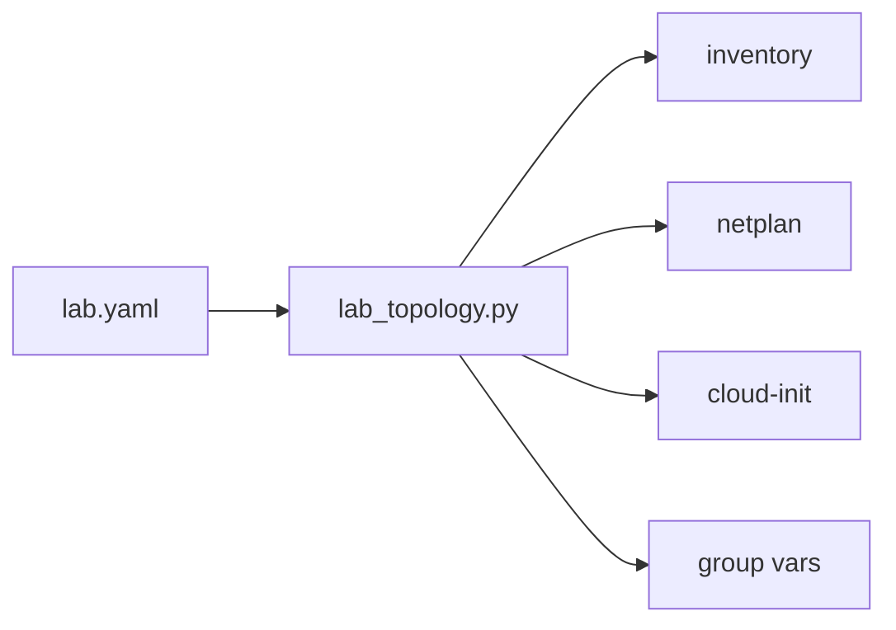

# Lab topology (`lab.yaml`)

**What's on this page**

- What `ansible/inventory/lab.yaml` declares (fabric, nodes, switch, orchestrator)
- Which files are **generated** from it (and which you never hand-edit)
- Validate, render, and drift-check commands
- How to move the orchestrator, change IPs, or re-cable the switch

**What this enables**

- One file as the single source of truth for the whole lab wiring
- Generated Ansible inventory, fabric group vars, per-node netplan, and cloud-init user-data
- Re-choosing the K3s control plane without touching cabling

The file is `ansible/inventory/lab.yaml`. The engine is `scripts/lib/py/lab_topology.py`
(shell wrapper: `scripts/lib/topology.sh`). `bazelisk run //:manage -- setup` and
`bazelisk run //:manage -- topology` drive it.



## The model

```yaml
lab:
  management:
    subnet: 10.0.0.0/24     # management LAN (K3s, SSH, dashboard)
  ansible_user: ubuntu
  fabric: switch            # none | pair | ring | switch
  switch:                   # only for fabric: switch
    brand: mikrotik
    model: CRS804-4DDQ-hRM
    host: 10.0.0.2          # switch management IP
    user: admin             # read-only probe user; password stays in LAB_SWITCH_PASSWORD
    port_map:
      - { node: spark0, port: sfpplus1 }
      - { node: spark1, port: sfpplus2 }
      - { node: spark2, port: sfpplus3 }
      - { node: spark3, port: sfpplus4a }
      - { node: spark4, port: sfpplus4b }
  nodes:
    - name: spark0
      ip: 10.0.0.10
      role: orchestrator    # exactly one node carries this
      hs_ifs: [enp1s0f0np0, enp1s0f1np1]
    - name: spark1
      ip: 10.0.0.11
      hs_ifs: [enp1s0f0np0, enp1s0f1np1]
```

### Fabric

| `fabric` | Nodes | Meaning |
| --- | --- | --- |
| `none` | 1 | single Spark, local NCCL only |
| `pair` | 2 | one QSFP cable at 200 Gb/s (netplan still addresses up to two cages) |
| `ring` | 3 | QSFP triangle, six /24 links (192.168.100–105) |
| `switch` | 4–5 | CRS804-4DDQ-hRM, one /24 per node (192.168.110–114) |

Node count must match the fabric: the validator rejects `pair` with 3 nodes, `ring`
with 2, more than 5 nodes overall, and — on a switch — a breakout lane without its
sibling (`sfpplus4a` alone is invalid).

### Nodes

- `name` — kebab-case, unique; becomes the inventory hostname and K3s node name.
- `ip` — management-LAN address, must sit inside `management.subnet`, unique.
- `role: orchestrator` — **exactly one** node. It becomes `k3s_server` / `k3s_control_plane`;
  every other node is `k3s_agent`. Move it freely — see [Choose topology](choose-topology.md).
- `hs_ifs` — high-speed interface name(s); required for every fabric except `none`.
  Pair/ring use up to two, switch uses one (the engine takes the first two or first
  respectively and validates the count).

### Switch block (`fabric: switch` only)

- `host` / `user` — read-only RouterOS probe target; the **password never appears in
  files** (`LAB_SWITCH_PASSWORD` env var at runtime).
- `port_map` — one `{node, port}` entry per node, covering every node exactly once.
  Lanes `…a` / `…b` are the two halves of a split 400G port (5-node lab) and must
  both be present.

## What gets generated

`bazelisk run //:manage -- topology render` (or `setup`) renders, all marked
*Generated — do not edit*:

| Artifact | Path | Consumer |
| --- | --- | --- |
| Ansible inventory | `ansible/inventory/hosts.ini` (gitignored) | every playbook |
| Fabric group vars | `ansible/inventory/group_vars/generated/fabric.yml` | `k3s_control_plane`, `lab_fabric`, switch facts, netplan dir |
| Per-node highspeed netplan | `ansible/files/generated/netplan/<node>-99-highspeed.yaml` | cloud-init and the `highspeed_network` role |
| Per-node cloud-init user-data | `ansible/files/generated/cloud-init/user-data-<node>.yaml` | vendor BMC / first-boot prep |

`hosts.ini` is gitignored on purpose — it is your lab's live inventory, not a repo default.

## Commands

```bash
# Validate the file (read-only; exits non-zero with readable errors)
bazelisk run //:manage -- topology validate

# Flat facts: fabric, node_count, orchestrator, switch_host, ...
bazelisk run //:manage -- topology facts

# Render the generated artifacts into the repo root
bazelisk run //:manage -- topology render

# Validate + drift report against live K3s nodes (read-only; needs cluster access)
bazelisk run //:manage -- topology check
```

Classic: `./scripts/manage.sh topology <subcommand>` — or call the module directly:
`python3 scripts/lib/py/lab_topology.py <validate|facts|render> ansible/inventory/lab.yaml`.

## Moving the orchestrator

Edit `lab.yaml`: drop `role: orchestrator` from the old node, add it to the new one,
then `topology render`. The regenerated inventory and `fabric.yml` point
`k3s_server` / `k3s_control_plane` at the new node.

- **Fresh lab:** nothing else to do — bootstrap with the new inventory.
- **Live lab:** this is a control-plane migration (stop Jobs, bootstrap the new server,
  rejoin agents), not a config flip. See [Choose topology → Pick your orchestrator](choose-topology.md#pick-your-orchestrator).

## Changing IPs or re-cabling the switch

- Node IPs / management subnet: edit `nodes[].ip` / `management.subnet`, re-render.
  Switching the management subnet of a live lab also means moving `ansible.cfg`
  expectations and OOB access — plan it like a maintenance window.
- Switch port map: rewire the `port_map` entries to match the cabling; lanes must stay
  in pairs. The validator rejects half a breakout.
- High-speed interface names: `hs_ifs` per node; confirm on each node with `ibdev2netdev`.

<Callout type="warning" title="Regenerate, don't hand-edit">
  Every generated file carries a `# Do not edit — regenerate` header. Hand edits are
  overwritten by the next `setup` / `topology render`. The topology file is the only
  place to change wiring.
</Callout>

## Next

- [Getting Started](../getting-started.md) — bootstrap gold path using the generated inventory
- [Interconnect & NCCL](../concepts/interconnect-nccl.md) — per-fabric NCCL env and verification
- [Choose topology](choose-topology.md) — which fabric matches your cables and models
