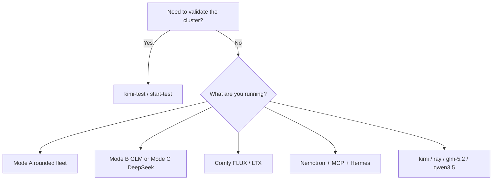

# Workload profiles

**What's on this page**

- Profile families and the `manage.sh` verbs that start them
- Mutual exclusion (Mode A vs B vs C, one visual Deployment)
- Where resource numbers live

**What this enables**

- Picking a **safe first** profile (`kimi-test`) then a daily or exclusive stack
- Stopping the right thing (`stop`, `stop-visual`, `stop-stack-rounded`, …)

Resource envelopes, restart policy, and NCCL flags are in [Workload catalog](../operate/workload-catalog.md) (from manifests + `config/resource-policy.yaml`). Comparison table: [Models catalog](../models-catalog.md).

## Decision

## Families

| Profile | Verb (Bazel: `bazelisk run //:manage -- <verb>`) | Topology | Notes |
| --- | --- | --- | --- |
| **kimi-test** | `start-test` | 1–4 | First validation. `backoffLimit: 2`. Not heavy. |
| **kimi** | `start-kimi` / `start-full` | 2+ typical | Heavy confirm + capacity. Prefer after test. |
| **Ray** | `start-ray` | 2+ | Head + worker Jobs; required by some large models. |
| **Nemotron Ultra** | `start-nemotron` | 2-node preferred | Ray + NVFP4. Heavy. |
| **GLM-5.2** | `start-glm` | **2-node required** | llama.cpp RPC; `hostNetwork` + `hostIPC`. |
| **Qwen 3.5** | `start-qwen3.5-122b-nvfp4`, `start-qwen3.5-397b-spark2`, `start-qwen3.5-397b-nvfp4` | 1 / 2 / **4** | 397B NVFP4 is four nodes. |
| **Qwen 3.6** | `start-qwen36-27b`, `start-qwen36-35b-a3b`, `start-qwen36-dual` | 1 | Dual needs GPU time-slicing. See [Qwen3.6 dual](../qwen36-dual-stack.md). |
| **Qwen 3.8 27B** | `start-qwen38-27b [--with-litellm]` | 1 | Dense NVFP4. Refuses Mode B and C. Open WebUI `lab-auto`. |
| **Mode A daily** | `start-stack-rounded` (`--quality` optional) | **3-node** | 35B + Flash-Next + MedGemma + LiteLLM. Refuses B and C. |
| **Mode B exclusive** | `start-glm-5.3-flash [--with-litellm]` | **3-node ring** | GLM-5.3-Flash TP=3. Refuses A and C. |
| **Mode C exclusive** | `start-deepseek-v4.1-flash [--with-litellm]` | **3-node ring** | DeepSeek-V4.1-Flash TP=3. Refuses A and B. V4.1-Pro is not released. |
| **Visual** | `start-comfy-base`, `start-flux-fast`, `start-flux-quality`, `start-ltx-balanced`, `start-ltx-quality`, `start-flux-to-ltx` | **1 node** | One visual Deployment. Manual. `stop-visual`. |
| **Agents** | `start-mcp`, `start-hermes`, `start-open-webui` | any | Plus Nemotron nano/super Jobs. See agent docs. |
| **Safe auto-pick** | `start-default` / `start-safe` | any | Always delegates to `start-test`. |

Classic equivalent: `./scripts/manage.sh <verb>`.

<Callout type="warning" title="Modes collide">
  `start-stack-rounded`, `start-glm53-flash`, and `start-dsv41-flash` **refuse each other**. Recover: stop the running mode, `doctor`, then start the one you want. Details: [LiteLLM rounded stack](../litellm-rounded-stack.md).
</Callout>
<Callout type="warning" title="Visual occupancy">
  Only one `workload: visual` Deployment. Compose learners should use [ez-comfy-stack](https://github.com/toxicoder/ez-comfy-stack), not this K3s path.
</Callout>
## Always

1. `bazelisk run //:manage -- doctor`
2. `bazelisk run //:manage -- estimate <model>`
3. Start with `start-test` on a new cluster
4. `stop` (or the stack-specific stop) before reboot — [Reboot safety](../reboot-safety.md)
