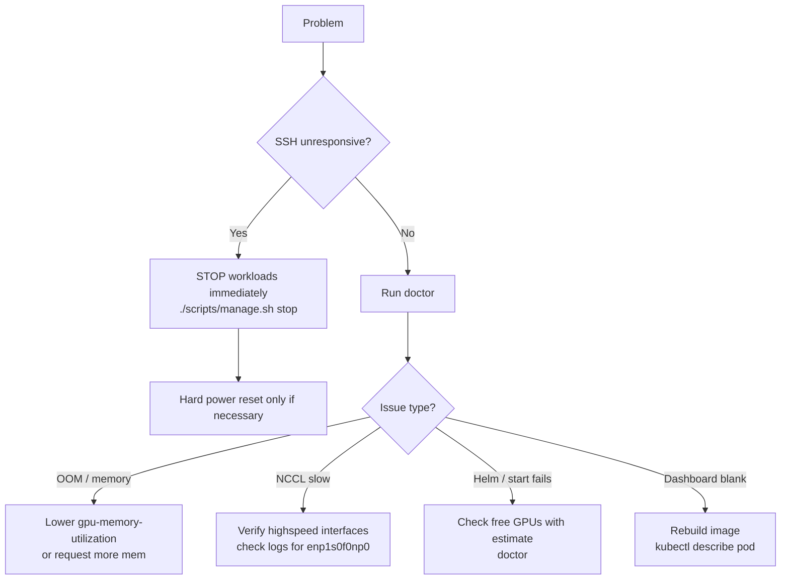

# Troubleshooting

**What's on this page**

- Quick diagnosis Mermaid flow and initial Bazel doctor + estimate commands
- Common problems & fixes: unresponsive SSH, scheduler "no resources", NCCL 400G, Grafana, dashboard, Helm, estimate "unknown"
- Verification steps, kubectl checks, and links to related safety docs
- Prevention guidance and still-stuck escalation

**What this enables**

- Rapid, safe first-stop resolution of cluster and workload issues
- Using Bazel-primary commands and documented prevention steps consistently
- Maintaining host stability when diagnosing large inference problems

This page is the first stop when something goes wrong.

## Quick Diagnosis Flow



Always run this first (Bazel primary):

```bash
bazelisk run //:manage -- doctor
bazelisk run //:manage -- estimate kimi-test
```

> The full command reference (including every flag for `doctor`, `estimate`, `start-*`, etc.) is **auto-generated** from structured comments in the scripts. See [Shell Commands & Helpers](generated/shell/reference.md). Refresh with `bazelisk run //docs:docs` after editing comments.

## Common Problems & Fixes

### SSH becomes completely unresponsive

**Cause**: Heavy inference job consumed host memory / CPU.

**Immediate action**:
```bash
# From any machine that can reach the node (IPMI/iDRAC console is best)
./scripts/manage.sh stop
# or on the node console
kubectl delete job --all -n ai-inference --ignore-not-found
```

**Prevention**:

- Always use `start-test` first.
- Never exceed the documented `gpu-memory-utilization`.
- Monitor with `./scripts/manage.sh status` + Grafana.

### "No resources" or scheduler won't place pod

**Hyper-detailed diagnosis steps**:

1. Run the estimator and doctor (Bazel):
   ```bash
   bazelisk run //:manage -- doctor
   bazelisk run //:manage -- estimate kimi-test
   ```

2. Check labels and taints:
   ```bash
   kubectl get nodes --show-labels
   kubectl describe node spark0 | grep -E 'Taints|Labels'
   ```

3. Look at the workload yaml (example for kimi-test):
   ```bash
   # See k8s/workloads/kimi-test/kimi-test-job.yaml for the exact requests/limits
   ```

4. If on multi-node: verify high-speed labeling happened during bootstrap.

See the [auto-generated reference](generated/shell/reference.md) for the full `doctor` and `estimate` implementations (they are extracted directly from the script source comments).

Common root causes and fixes:

- Not enough free GPUs after previous job (use `stop` + `cleanup`).
- Resource requests > allocatable (reduce in the manifest or use a lighter model).
- Missing node labels (re-run the bootstrap or GPU operator play via the Bazel targets).

**Verification after fix**:
```bash
bazelisk run //:manage -- start-test
kubectl get pods -n ai-inference -w
```

See also the full [Models & Resources catalog](models-catalog.md) and the generated shell ref.

```bash
kubectl get nodes --show-labels | grep highspeed
kubectl describe pod -n ai-inference -l workload=inference | grep -A 20 "Node-Selectors\|Tolerations"
```

Fix: the workload yamls expect certain labels applied by bootstrap + highspeed role.

Re-apply labels:

```bash
ansible-playbook -i ... playbooks/bootstrap-cluster.yml --tags label
```

### NCCL not using the 400G links

```bash
kubectl logs -n ai-inference job/kimi -c inference | grep -i nccl | head -20
```

Look for `NCCL_SOCKET_IFNAME=enp1s0f0np0,enp1s0f1np1`.

If falling back, verify the netplan highspeed config was applied and the interfaces are up on both nodes.

### Grafana has no GPU data

GPU Operator should install DCGM exporter by default.

```bash
kubectl get pods -n gpu-operator -l app=nvidia-dcgm-exporter
```

If missing, re-run the GPU Operator playbook.

Node metrics (CPU, disk) appear after node-exporter is deployed (see dev-workspaces.md).

### Dashboard won't load or actions do nothing

1. Image must be built and present:
   ```bash
   docker build -t lab-dashboard:local -f dashboard/Dockerfile .
   # then load into your cluster nodes or use imagePullPolicy: Never
   ```
2. The Deployment in `k8s/dev/dashboard/deployment.yaml` uses `lab-dashboard:local`.
3. RBAC is read-only by design — mutations go through `manage.sh`.

### estimate says "unknown" GPUs

The function uses `kubectl get nodes -o json` + allocatable math. Run on a machine with a working kubeconfig and jq.

Inside a Coder workspace that has the cluster context it will work.

### Helm timeouts / repo issues during start-monitoring

```bash
helm repo update
helm repo add grafana https://grafana.github.io/helm-charts || true
```

Network from control plane must reach the internet (or have an internal mirror).

## Still Stuck?

1. `./scripts/manage.sh doctor`
2. `kubectl get events -n ai-inference --sort-by=.lastTimestamp | tail -30`
3. Check host `dmesg` and `nvidia-smi` on the nodes.
4. Open an issue with the doctor output + relevant logs.

See also:

- [reboot-safety.md](reboot-safety.md)
- [dgx-spark-notes.md](dgx-spark-notes.md)
- [dev-workspaces.md](dev-workspaces.md)
