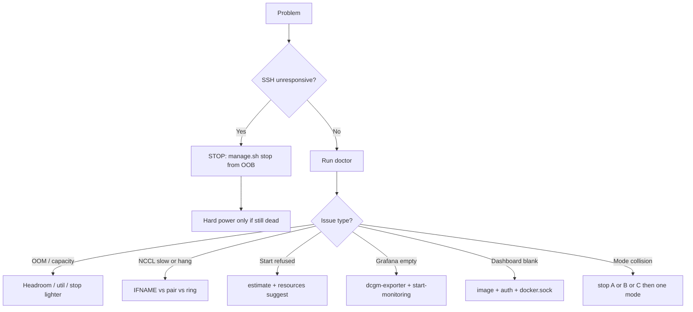

# Troubleshooting

**What's on this page**

- Top-level decision tree
- Symptom tables (SSH, capacity, NCCL, Grafana, dashboard, modes, visual)
- `doctor` / `estimate` as the first commands

**What this enables**

- Recovering a remote Spark without guessing
- Preventing the same hang on the next start

<ClusterConfigPanel />

<Callout type="info" title="Try this first">
  ```bash
  bazelisk run //:manage -- doctor
  bazelisk run //:manage -- estimate kimi-test
  ```

  Classic: `./scripts/manage.sh doctor`. Many rows below are hard failures doctor already reports.
</Callout>
## Decision tree



Generated flags: [Shell reference](generated/shell/reference.md).

## SSH unresponsive

| Symptom | Likely cause | Action | Prevention | Verify |
| --- | --- | --- | --- | --- |
| SSH hangs, node otherwise powered | Inference consumed unified memory | OOB console: `./scripts/manage.sh stop` or `kubectl delete job --all -n {{NAMESPACE}}` | `start-test` first; Guard 15%/24Gi; util caps | SSH works; `kubectl get pods -n {{NAMESPACE}}` empty |
| Still dead after stop | Kernel OOM / GPU driver wedged | BMC power cycle **after** accepting Jobs are gone | Never reboot *with* Jobs still scheduled | `doctor` after boot |

<Callout type="error" title="Do not start another heavy Job to “test” a hung node" />
## Scheduler / no resources

| Symptom | Likely cause | Action | Prevention | Verify |
| --- | --- | --- | --- | --- |
| Pod Pending Insufficient nvidia.com/gpu | Previous Job still allocated | `stop` + `cleanup` of leftover Jobs | One heavy profile at a time | `kubectl describe pod` |
| Pending memory | Requests > allocatable − headroom | `resources suggest`; lighter overlay | Policy matches manifests | `estimate <model>` |
| Pending on 1-node with TP=2 | Overlay still 2 GPU | `k8s/overlays/single-node` | [Overlays](operate/overlays.md) | `kubectl kustomize` |
| `estimate` unknown GPUs | Broken kubeconfig / no jq | Run doctor on a host with cluster access | Keep fetched kubeconfig | doctor GPU lines |

## NCCL / fabric

| Symptom | Likely cause | Action | Prevention | Verify |
| --- | --- | --- | --- | --- |
| All-reduce on 10GbE | Wrong `NCCL_SOCKET_IFNAME` | Stop Job; fix env from `ibdev2netdev` | Pair env only on pair Jobs | logs `grep -i nccl` |
| Mode B/C hang | Pair env copied onto ring | Use ring block in glm-5.3 / deepseek Jobs | [Interconnect](concepts/interconnect-nccl.md) | `doctor-fabric` |
| Half-alive ring | QSFP polarity | Recable Port0→Port1 triangle | Label cages | `ibdev2netdev` + ping |

## Grafana / DCGM

| Symptom | Likely cause | Action | Prevention | Verify |
| --- | --- | --- | --- | --- |
| No GPU panels | dcgm-exporter missing | Re-run GPU Operator; `start-monitoring` | Wait for gpu-operator Ready | `kubectl get pods -n gpu-operator -l app=nvidia-dcgm-exporter` |
| Node CPU empty | node-exporter not installed | `install-dev-workspaces` / `start-monitoring` | [Monitoring](monitoring-observability.md) | Grafana Explore |

## Dashboard

| Symptom | Likely cause | Action | Prevention | Verify |
| --- | --- | --- | --- | --- |
| Blank page | Image `lab-dashboard:local` missing | Build `dashboard/Dockerfile`; `imagePullPolicy: IfNotPresent` | Helm values | `kubectl describe pod -n dev` |
| Actions no-op | Session / RBAC | Log in; mutations are server actions | Do not `AUTH_BYPASS` | Network tab 401 |
| Tasks cannot see Docker | docker.sock not mounted | Check dashboard Deployment | Understand blast radius | [Dashboard](operate/dashboard.md) |

## Mode collision / visual

| Symptom | Likely cause | Action | Prevention | Verify |
| --- | --- | --- | --- | --- |
| `start-stack-rounded` refuses | Mode B or C still up | `stop-glm53-flash` / `stop-dsv41-flash` | One of A/B/C | `status-stack` |
| `start-glm53-flash` refuses | Mode A or C | `stop-stack-rounded` or stop C | Exclusive ring | `status-stack` |
| Visual start blocked | Another `workload: visual` | `stop-visual` | One Comfy Deployment | `status-visual` |

## Disk full / NVMe

| Symptom | Likely cause | Action | Prevention | Verify |
| --- | --- | --- | --- | --- |
| `df` 85%+ on `/` or `/mnt/models` | HF hub leftovers, incomplete pulls, containerd images | `disk-wizard status` then `recommend --target-gib N` then `apply --yes` | Reap interrupted downloads; do not leave ad-hoc `hf download` trees | `disk-wizard status --json` pressure not `crit` |
| Space did not return after delete | File still open (`mmap` / fd) | `disk-wizard explain PATH`; stop the Job | Wizard refuses in-use paths | `lsof` / pod gone |
| Download utility fails mid-pull | NVMe full | Step A first (`*.incomplete`, pip cache) | `status` before a 100 GB+ pull | `df -h` |

See [Disk wizard](operate/disk-wizard.md). Do not `docker system prune -a --volumes`.

## Still stuck

1. `bazelisk run //:manage -- doctor` output
2. `kubectl get nodes,pods -A`
3. [Node failure](operate/node-failure.md) if a worker is NotReady
4. Do not raise vLLM util above the documented caps to “make it fit”
