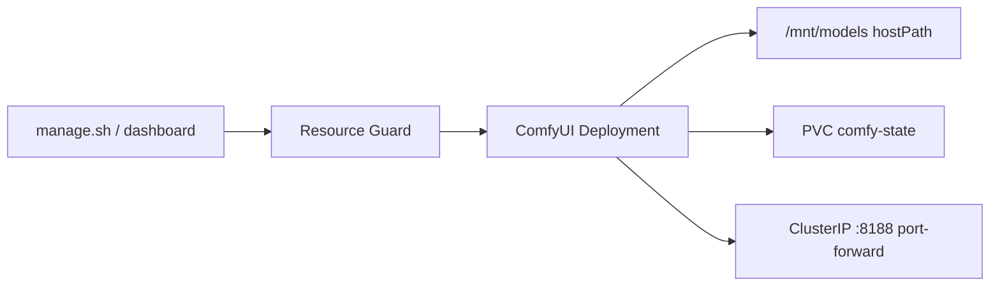

# Visual Generative AI on DGX Spark

**What's on this page**

- Architecture for ComfyUI visual workloads (FLUX.2 + LTX-2.3)
- Spark unified-memory patches and why they matter
- Download, start/stop, and pipeline commands
- Provisional benchmarks and troubleshooting

**What this enables**

- Production-grade **manual** lifecycle for image and audio-synced video gen
- Ultra-optimized paths for Blackwell NVFP4 / FP8 on 128 GB unified memory
- Combined **Flux → LTX** text-to-image-to-video in a single pod

## Hardware assumptions

| Resource | Value |
| --- | --- |
| Node | 1× DGX Spark (GB10 Grace Blackwell, ARM64) |
| Unified memory | 128 GB LPDDR5x |
| Physical GPUs | 1 (exclusive visual pod) |
| Model cache | hostPath `/mnt/models` |
| Comfy state | PVC `comfy-state` (install, custom_nodes, outputs) |

## Architecture



| Workload | Profile | Memory req | Notes |
| --- | --- | --- | --- |
| `comfy-base` | Runtime only | 60Gi | Spark patches + custom nodes |
| `flux-fast` | Klein 9B NVFP4 + Nunchaku | 60Gi | ~4s / 1024² target |
| `flux-quality` | Dev FP8 | 70Gi | Max quality |
| `ltx-balanced` | LTX-2.3 distilled FP8 | 70Gi | Kijai split + audio VAE |
| `ltx-quality` | LTX-2.3 BF16 distilled | 80Gi | Higher fidelity |
| `flux-to-ltx` | Pipeline | **90Gi** | Both families resident |

All are **Deployments** in `ai-inference`, label `workload: visual`, **manual start only**.

## Spark-specific optimizations

### Unified-memory free-memory patch

On GB10, `cudaMemGetInfo` under-reports free “VRAM” when another CUDA process holds allocations. ComfyUI then thrash-offloads models onto the **same** physical RAM.

**Fix (applied by init ConfigMap):** override free-memory query with `psutil.virtual_memory().available` in `comfy/model_management.py`.

### Env defaults

| Variable | Value | Purpose |
| --- | --- | --- |
| `PYTORCH_CUDA_ALLOC_CONF` | `expandable_segments:True` | Less allocator fragmentation |
| `CUDA_MODULE_LOADING` | `LAZY` | Faster startup |
| `LAB_VISUAL_ENABLE_NVFP4` | `1` | Hint for NVFP4 / Nunchaku paths |

Nunchaku and SageAttention install **fail-soft** if aarch64 wheels are unavailable.

## Models & downloads

| Tier | HF sources | Utility |
| --- | --- | --- |
| Flux fast | `black-forest-labs/FLUX.2-klein-9b-nvfp4`, `tonera/FLUX.2-klein-9B-Nunchaku` | `download-flux` |
| Flux quality | `black-forest-labs/FLUX.2-dev` | `download-flux` |
| LTX | `Kijai/LTX2.3_comfy` | `download-ltx` |

```bash
bazelisk run //scripts:run-utility -- download-flux status --tier all
bazelisk run //scripts:run-utility -- download-flux run --tier fast
bazelisk run //scripts:run-utility -- download-ltx run --tier balanced
```

Weights are snapshotted under `MODELS_DIR` (default `/mnt/models`) and best-effort linked into `models/comfy/*` for ComfyUI.

Accept model licenses on Hugging Face (BFL / LTX community licenses) and set `HF_TOKEN` when required.

## Commands

```bash
# Base runtime
bazelisk run //:manage -- start-comfy-base

# Image
bazelisk run //:manage -- start-flux-fast
bazelisk run //:manage -- start-flux-quality

# Video
bazelisk run //:manage -- start-ltx-balanced
bazelisk run //:manage -- start-ltx-quality

# Combined pipeline (90Gi)
bazelisk run //:manage -- start-flux-to-ltx

# Status / stop
bazelisk run //:manage -- status-visual
bazelisk run //:manage -- stop-visual

# UI
kubectl -n ai-inference port-forward svc/flux-fast 8188:8188
```

Dashboard **Inference & visual** panel also starts these IDs with capacity gate + heavy confirm.

## Combined pipeline

1. Download flux **fast** + ltx **balanced**
2. `start-flux-to-ltx` (exclusive GPU, 90Gi request)
3. In ComfyUI: run Flux T2I then LTX I2V + audio (workflow note auto-mounted under user workflows)
4. Prefer keeping both model sets loaded; avoid full unload between stages on unified memory

## Benchmarks (provisional)

Figures are **indicative** until measured on your Spark image pin. Method: warm pod, single 1024² image or short clip, no concurrent LLM.

| Workload | Resolution / length | Expected (GB10) | Resident est. |
| --- | --- | --- | --- |
| flux-fast | 1024², ~4 steps | ~4–8 s / image | 15–25 GB |
| flux-quality | 1024², more steps | tens of seconds | higher |
| ltx-balanced | short I2V + audio | minutes-class (clip-dependent) | mid |
| flux-to-ltx | T2I then I2V | sum of stages + load | up to ~90 Gi budget |

Record real numbers with:

```bash
# After port-forward, time a fixed workflow in the UI or API queue
# Note: cold start (first PVC install) is 10–30+ minutes — exclude from latency
```

## Safety

- **No auto-start** on reboot
- Explicit resources + Resource Guard `enforce_capacity`
- **One visual Deployment at a time** (`guard_active_visual`)
- Heavy confirmation for all visual starts
- Conflicts with large LLM Jobs on the same GPU — stop LLMs first
- Always `stop-visual` before node reboot ([reboot-safety](reboot-safety.md))

## Troubleshooting

| Symptom | Likely cause | Action |
| --- | --- | --- |
| Extreme offload / 5–15× slow | Unpatched free-memory | Confirm spark patch ConfigMap; re-run init |
| Pending pod | Capacity / headroom | `manage.sh resources check --action model:flux-fast` |
| OOM mid-load | Double RAM+VRAM count on Spark | Prefer NVFP4/FP8; use flux-fast; raise request carefully |
| Nunchaku missing | aarch64 wheel fail | Fail-soft install; quality path still works |
| Empty models | Download not run on node | `download-flux` / `download-ltx` on Spark host |
| Cold start forever | First PVC pip/git | Wait; check init container logs |

## Related

- Workload READMEs under `k8s/workloads/comfy-base/` and `k8s/workloads/comfy-visual/`
- [Models catalog](models-catalog.md)
- [Resource Guard](resource-guard.md)
- [Qwen3.6 dual stack](qwen36-dual-stack.md) (LLM counterpart patterns)
